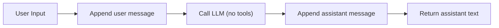
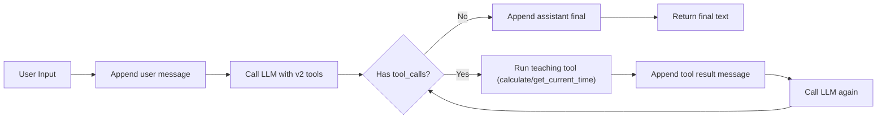
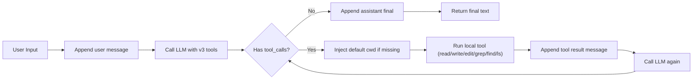
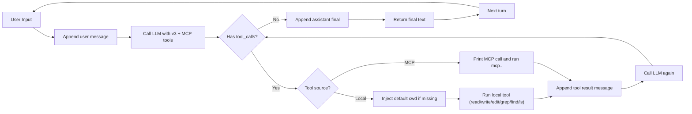
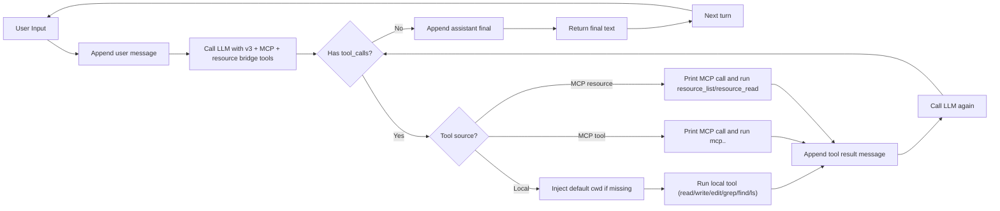

# Agent Loop Flows (Mermaid)

本文档用于教学展示 `v1/v2/v3/v4/v4.1` 的执行流程差异。  
建议用支持 Mermaid 的 Markdown 工具查看（如 GitHub、Typora Mermaid 插件、VSCode Mermaid 预览插件）。  
若当前编辑器不支持 Mermaid，可直接查看同目录下已渲染的 SVG：
- `docs/diagrams/v1.svg`
- `docs/diagrams/v2.svg`
- `docs/diagrams/v3.svg`
- `docs/diagrams/v4.svg`
- `docs/diagrams/v4_1.svg`

## v1: Basic Chat Loop

## v2: Teaching Tools Loop

## v3: CLI Tools Loop

## v4: MCP Tools Loop

## v4.1: MCP + Resource Bridge Loop

