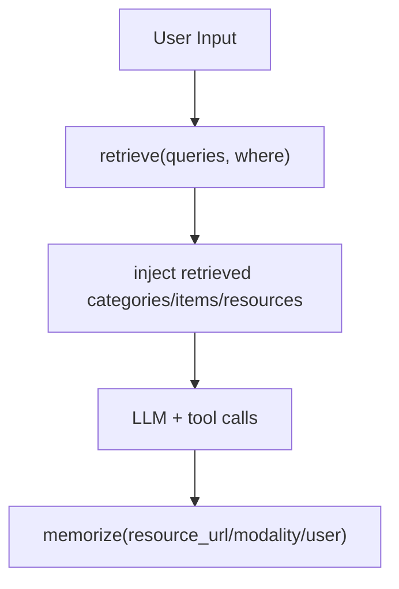

# MemU 源码调研（先会用，再看内部实现）

这版只讲源码里已经实现的东西，不讲宣传话术。

---

## 1. 先给结论（最重要）

1. 开源版核心入口是 `MemoryService`，不是 Cloud API 网关。  
2. `memorize` 和 `retrieve` 都是“工作流流水线”，不是单函数硬编码。  
3. “三层”在开源实现里是 **Resource / Item / Category 三类对象**，底层存储是数据库（inmemory/sqlite/postgres），不是你本地目录自动产出三层文件树。  
4. 排序支持两种：`similarity` 和 `salience(相似度 × 强化次数 × 时间衰减)`。

源码证据：
- `/tmp/memU/src/memu/app/service.py:49`
- `/tmp/memU/src/memu/app/memorize.py:65`
- `/tmp/memU/src/memu/app/retrieve.py:42`
- `/tmp/memU/src/memu/database/factory.py:15`
- `/tmp/memU/src/memu/database/inmemory/repositories/memory_item_repo.py:169`

---

## 2. 你该怎么用（最小可跑）

## 2.1 直接用 Python SDK（开源版最真实用法）

```python
from memu.app import MemoryService

service = MemoryService(
    llm_profiles={"default": {"api_key": "<OPENAI_API_KEY>"}},
    database_config={"metadata_store": {"provider": "inmemory"}},
    retrieve_config={"method": "rag"},
)

# 回合后写入
await service.memorize(
    resource_url="/absolute/path/to/conversation.json",
    modality="conversation",
    user={"user_id": "u_001"},
)

# 回合前检索
result = await service.retrieve(
    queries=[{"role": "user", "content": {"text": "用户偏好是什么"}}],
    where={"user_id": "u_001"},
)
print(result)
```

对应测试用例：
- `/tmp/memU/tests/test_inmemory.py:40`
- `/tmp/memU/tests/test_inmemory.py:56`

## 2.2 在 agent loop 里挂点（推荐顺序）

1. Pre-turn：`retrieve` 拿 top-k 记忆
2. 注入系统上下文
3. 调 LLM + 工具
4. Post-turn：`memorize` 写回本轮信息



## 2.3 真实运行样例（MiniMax + 智谱 embedding）

本仓库实测脚本：
- `/Users/admin/work/agent_loop/tests/research/memory/run_memu_rich_demo_real.py`

实测命令：

```bash
export MINIMAX_API_KEY='...'
export ZHIPU_API_KEY='...'
conda run -n py312 python /Users/admin/work/agent_loop/tests/research/memory/run_memu_rich_demo_real.py \
  --config /Users/admin/work/agent_loop/configs/default.json \
  --embed-base-url https://open.bigmodel.cn/api/paas/v4 \
  --embed-model embedding-3
```

完整输出存档：
- `/Users/admin/work/agent_loop/backups/memu/runs/memu_rich_demo_real_output.txt`

这次实测结果（对照表）：

| 输入对话（原文） | `memorize` 抽取到的记忆（节选） | 在本次 `retrieve` 是否命中 |
|---|---|---|
| 我现在在上海浦东张江办公，最近在做 AI agent 教学项目。 | 用户在上海浦东张江办公；用户目前在做 AI agent 教学项目 | 命中（2 条） |
| 后续默认中文回复，先给结论再给细节。 | 用户偏好用中文回复，希望先给结论再给细节（profile + behavior） | 命中（2 条） |
| 我工作日 7 点会跑步 5 公里，周日去朝阳公园骑行。 | 工作日早上 7 点跑步 5 公里；周日朝阳公园骑行（profile + behavior） | 命中（3 条） |
| 下周二 10 点我在上海张江有评审会，下下周要去深圳南山出差。 | 2026-03-03 10:00 上海张江评审会；下下周深圳南山出差（event） | 命中（2 条） |
| [TOOL] calendar.create ... | 未直接形成独立记忆（作为上下文辅助） | 无单独命中 |

本次总量：
- 输入 7 条
- `memorize`：10 条 item / 5 个 category
- `retrieve`：8 条 item / 4 个 category

---

## 3. `memorize` 内部到底做了什么（源码流程）

`memorize()` 入口在：
- `/tmp/memU/src/memu/app/memorize.py:65`

它不是一步完成，而是 7 个 step 的 pipeline：
- `ingest_resource`
- `preprocess_multimodal`
- `extract_items`
- `dedupe_merge`
- `categorize_items`
- `persist_index`
- `build_response`

定义位置：
- `/tmp/memU/src/memu/app/memorize.py:97`

关键细节：

1. `ingest_resource`：先把资源抓到本地 + 取原始文本。  
2. `extract_items`：按 memory type prompt 抽结构化条目。  
3. `categorize_items`：为 item 生成 embedding，映射到 category。  
4. `persist_index`：更新 category summary（可选写 item 引用）。  
5. 输出 `resource/items/categories/relations`。

说明：
- `dedupe_merge` 当前还是 placeholder（注释写明未来扩展）。
- 真正的去重强化主要在 repo 层的 `create_item_reinforce`。

证据：
- `/tmp/memU/src/memu/app/memorize.py:203`
- `/tmp/memU/src/memu/app/memorize.py:238`
- `/tmp/memU/src/memu/app/memorize.py:258`
- `/tmp/memU/src/memu/database/inmemory/repositories/memory_item_repo.py:122`

---

## 4. `retrieve` 内部怎么跑（源码流程）

入口：
- `/tmp/memU/src/memu/app/retrieve.py:42`

有两条工作流：

1. `retrieve_rag`
- 类别召回 -> sufficiency 判断 -> item 召回 -> sufficiency -> resource 召回 -> build_context
- 定义：`_build_rag_retrieve_workflow`
- 位置：`/tmp/memU/src/memu/app/retrieve.py:106`

2. `retrieve_llm`
- 用 LLM 做 category/item/resource rank
- 定义：`_build_llm_retrieve_workflow`
- 位置：`/tmp/memU/src/memu/app/retrieve.py:454`

关键机制：

- `route_intention`：先判断这次要不要检索、是否改写 query
- `sufficiency_check`：每层召回后判断“信息够不够”，不够才继续下钻
- `where`：严格按 scope 过滤（如 `user_id`）

证据：
- `/tmp/memU/src/memu/app/retrieve.py:57`
- `/tmp/memU/src/memu/app/retrieve.py:88`
- `/tmp/memU/src/memu/app/retrieve.py:292`
- `/tmp/memU/src/memu/app/retrieve.py:373`

---

## 5. 存储层是不是“文件系统三层”？

不是。

开源版默认是数据库抽象：
- `inmemory`
- `sqlite`
- `postgres`

工厂选择逻辑：
- `/tmp/memU/src/memu/database/factory.py:15`

默认配置：
- `/tmp/memU/src/memu/app/settings.py:310`

“三层”在代码里是三类记录对象：
- `Resource`
- `MemoryItem`
- `MemoryCategory`

对象定义：
- `/tmp/memU/src/memu/database/models.py:66`

所以你之前问的“调用 memorize 后会不会自动归档成三层文件系统”——
结论是：**会归档成三层对象关系，但开源代码里不是默认落成三层目录文件。**

---

## 6. 检索打分怎么算（不是黑箱）

`item` 检索支持：

1. `similarity`：纯 cosine
2. `salience`：
`score = similarity * log(reinforcement_count + 1) * recency_decay`

实现位置：
- `/tmp/memU/src/memu/database/inmemory/vector.py:14`
- `/tmp/memU/src/memu/database/inmemory/repositories/memory_item_repo.py:169`
- `/tmp/memU/src/memu/database/postgres/repositories/memory_item_repo.py:280`

强化记忆（reinforcement）在创建 item 时处理：
- 通过 `content_hash` 去重
- 命中同条目就增加 `reinforcement_count`

实现位置：
- `/tmp/memU/src/memu/database/inmemory/repositories/memory_item_repo.py:122`
- `/tmp/memU/src/memu/database/postgres/repositories/memory_item_repo.py:162`

---

## 7. 能力、优势、短板（基于源码）

## 7.1 能力

1. 流水线化 memory（step 可插拔）
2. 双检索模式（rag / llm）
3. scope 过滤（多用户隔离）
4. salience 排序（强化 + 时间衰减）
5. 存储后端可替换（inmemory/sqlite/postgres）

## 7.2 优势

1. 架构清晰，可插拦截器和 pipeline mutation
2. 从教学到工程迁移成本较低
3. 检索链路有显式 sufficiency 控制

## 7.3 短板

1. 开源仓库没把 Cloud API 网关代码一起开出来（主要是 SDK/core）
2. `dedupe_merge` step 仍是占位
3. 复杂冲突治理策略（跨类别冲突、生命周期策略）还需要你外层补策略
4. `route_intention` 在“明显需要长期记忆”的真实请求上会误判，导致整个检索链路被短路

### 7.4 真实误判案例（本仓库复现）

场景（共享基准 Case 13，真实生活化触发）：
- 对话输入：62 轮
- 测试查询：8 条（点餐、咖啡、被猫挠、跳槽简历、分享会、订票、重装软件、找钥匙）
- 输出文件：`/Users/admin/work/agent_loop/backups/memu/runs/memu_rich_demo_daily_habits_output_after_user_edit.txt`

运行结果（8 条 query 汇总）：
- `needs_retrieval=True`：4/8
- `items_hit>0`：2/8
- “触发了检索但无命中”：2/8

逐条摘要：
1. Query-1（点餐避雷）→ `needs_retrieval=False`, `items_hit=0`
2. Query-2（推荐咖啡）→ `needs_retrieval=True`, `items_hit=8`（有噪声）
3. Query-3（被猫挠处理）→ `needs_retrieval=False`, `items_hit=0`
4. Query-4（按背景写简历）→ `needs_retrieval=False`, `items_hit=0`
5. Query-5（分享会题目提纲）→ `needs_retrieval=True`, `items_hit=8`（有噪声）
6. Query-6（订票要点）→ `needs_retrieval=False`, `items_hit=0`
7. Query-7（常用软件清单）→ `needs_retrieval=True`, `items_hit=0`
8. Query-8（按习惯找钥匙）→ `needs_retrieval=True`, `items_hit=0`

这说明不仅有“该检索却没检索”，还存在“判定要检索但召回为空”和“召回噪声”。

源码证据：
- `retrieve()` 把最后一条当 `original_query`，其余当 `context_queries`：`/tmp/memU/src/memu/app/retrieve.py:51`
- `route_intention` 会先调用 `_decide_if_retrieval_needed`：`/tmp/memU/src/memu/app/retrieve.py:241`
- 一旦 `needs_retrieval=False`，后续 category/item 召回直接跳过：`/tmp/memU/src/memu/app/retrieve.py:261`
- 判定由 LLM prompt 输出 `RETRIEVE/NO_RETRIEVE`，不是硬规则：`/tmp/memU/src/memu/app/retrieve.py:746`
- 该 prompt 里明确存在 `NO_RETRIEVE` 分支：`/tmp/memU/src/memu/prompts/retrieve/pre_retrieval_decision.py:15`

调研结论（按真实使用视角）：
- 这不是 benchmark 姿势问题，是真实用户表达下的稳定性问题。
- 当前可归纳为：**检索触发不稳定 + 召回后命中/噪声控制不足**。

---

## 8. 跑分怎么理解

官方给 LoCoMo 指标（README 口径）可以参考，但依然建议你按统一协议做复现对比。  
这个结论不变：把它当“积极信号”，别当“不可争议 SOTA”。

---

## 9. 给我们项目的直接启发（可落地）

1. v6.2 可以先借鉴它的调用节奏：`pre-turn retrieve + post-turn memorize`。
2. 先做 similarity 排序，后续再加 salience（强化/时效）
3. 先落地 sqlite，再考虑 pgvector
4. 冲突治理和逐出策略要在我们自己的 policy 层显式实现

---

## 10. 参考

- MemU 仓库：<https://github.com/NevaMind-AI/memU>
- 关键 ADR：`/tmp/memU/docs/adr/0001-workflow-pipeline-architecture.md`
- 最小测试：`/tmp/memU/tests/test_inmemory.py`
