# pi-mono 短期记忆机制（详细调研）

本文聚焦 pi-mono（`packages/coding-agent`）在**短期记忆**上的工程机制：

- 当前会话上下文（working context）如何维护
- 何时触发压缩（compaction）
- 压缩结果如何持久化
- 重启/恢复时如何重建
- 边界条件如何处理

结论先给：

- pi-mono 的短期记忆是“**可重建的工作上下文**”，不是单独持久化的一个 `working_messages` 文件。
- 持久化层是 JSONL 事件流；运行层通过 `buildSessionContext()` 动态重建。
- 压缩不是覆盖历史，而是追加 `compaction` entry + 在运行内存中替换消息窗口。

## 流程图（总览）

## 1. 设计目标（从源码行为反推）

pi-mono 把“短期记忆管理”拆成两层：

1. 事实留存层（append-only session log）
2. 运行上下文层（模型当前真正可见的 messages）

这带来三个好处：

- 可审计：历史不会因压缩被覆盖
- 可恢复：崩溃/重启后可重建到当前分支状态
- 可分支：基于 `id/parentId` 树结构支持 tree/fork

核心实现：

- `/Users/admin/work/pi-mono/packages/coding-agent/src/core/session-manager.ts`
- `/Users/admin/work/pi-mono/packages/coding-agent/src/core/agent-session.ts`
- `/Users/admin/work/pi-mono/packages/coding-agent/src/core/compaction/compaction.ts`
- `/Users/admin/work/pi-mono/packages/coding-agent/docs/session.md`

## 2. 存储形态：JSONL + 树结构 entry

默认路径：

- `~/.pi/agent/sessions/--<cwd-encoded>--/<timestamp>_<uuid>.jsonl`

关键 entry 类型：

- `session`：header
- `message`：user/assistant/toolResult
- `compaction`：摘要与保留起点
- `model_change`
- `thinking_level_change`
- `branch_summary`
- `custom` / `custom_message`

每条 entry 都有：

- `id`
- `parentId`
- `timestamp`

`id/parentId` 形成会话树，leaf 指向当前分支位置。

## 3. 写入时机：事件驱动追加（非整段覆盖）

`AgentSession` 在 `message_end` 时持久化：

- user/assistant/toolResult -> `appendMessage`
- custom message -> `appendCustomMessageEntry`

实现位置：

- `/Users/admin/work/pi-mono/packages/coding-agent/src/core/agent-session.ts`

`SessionManager._appendEntry()` 会：

- 更新 `fileEntries`
- 更新 `byId/leafId`
- 调 `_persist()` 写入磁盘

### 3.1 首次 assistant 前不 flush 的细节

`_persist()` 有 `hasAssistant` 判定：

- 如果 session 里还没有 assistant 消息，则不落盘
- 一旦出现首条 assistant，先把累积 entry 全量 flush
- 之后每条增量 append

这解释了“空会话/只输入未出答”的文件可见性差异。

## 4. 触发压缩：两条路径

### 4.1 手动压缩

- 用户命令触发（例如交互层 `/compact`）
- 调 `AgentSession.compact()`

### 4.2 自动压缩

`agent_end` 后 `_checkCompaction()` 判定：

1. **overflow 路径**
- assistant 返回上下文溢出错误
- 从运行上下文移除错误 assistant
- 自动 compact
- compact 后自动 retry

2. **threshold 路径**
- 计算 `contextTokens`
- `shouldCompact(contextTokens, contextWindow, settings)` 为真则触发
- 默认逻辑：`contextTokens > contextWindow - reserveTokens`

默认配置（settings）：

- `reserveTokens = 16384`
- `keepRecentTokens = 20000`

实现位置：

- `/Users/admin/work/pi-mono/packages/coding-agent/src/core/agent-session.ts`
- `/Users/admin/work/pi-mono/packages/coding-agent/src/core/compaction/compaction.ts`
- `/Users/admin/work/pi-mono/packages/coding-agent/src/core/settings-manager.ts`

## 5. 压缩算法（prepare + summarize + appendCompaction）

整体流程：

1. `prepareCompaction(pathEntries, settings)`
2. 选择切点，保证保留最近区段（含 tool 链）
3. 生成摘要（pi 默认逻辑或扩展 hook 提供）
4. `appendCompaction(summary, firstKeptEntryId, tokensBefore, details, fromHook)`
5. `buildSessionContext()` 重建并 `agent.replaceMessages(...)`

### 5.1 切点策略重点

源码体现了几个工程约束：

- 尽量不把切点落在 `toolResult` 上（避免打断工具链语义）
- 保留最近 token 区段（`keepRecentTokens`）
- 支持已有 compaction 基础上的增量压缩

### 5.2 摘要产物

`compaction` entry 关键字段：

- `summary`
- `firstKeptEntryId`
- `tokensBefore`
- `details`（可选，扩展数据）
- `fromHook`（是否由扩展提供压缩内容）

## 6. 恢复机制：working context 动态重建

关键函数：`buildSessionContext()`

流程：

1. 从当前 leaf 回溯到 root 得到 path
2. 提取当前有效设置（model/thinkingLevel）
3. 若 path 存在 compaction：
- 先注入 `compactionSummary`
- 再注入从 `firstKeptEntryId` 到 compaction 前的保留消息
- 再注入 compaction 后消息
4. 若无 compaction：按 path 正常还原

这就是“重启后 working msg 怎么回来”的核心。

## 7. 自动压缩与重试的关系

overflow 场景下：

- 先 compact
- 然后延迟触发 `agent.continue()` 自动重试

threshold 场景下：

- compact 后不强制继续，由用户/下一轮输入推进

好处是：

- overflow 可以自动恢复
- threshold 不会擅自推进任务

## 8. 扩展点（为什么工程弹性大）

pi-mono 支持 extension hook 介入 compaction：

- `session_before_compact`：可取消、可替换 compaction 结果
- `session_compact`：压缩后事件

这使“短期记忆压缩策略”可以替换成：

- 结构化摘要
- 领域特定摘要
- 带 artifact 索引的摘要

而不改主干 loop。

## 9. 常见误解澄清

### 误解 1：压缩后历史丢失

不是。历史仍在 JSONL，压缩只影响运行上下文构造。

### 误解 2：有单独的 `working_messages` 持久化文件

没有。working context 是从 session entries 动态重建。

### 误解 3：每轮都整体重写 session

不是。是 append-only，除迁移/修复等少数场景会 rewrite。

## 10. 用教学语言总结

可以把 pi-mono 短期记忆理解成：

- 硬盘上存“完整对话流水账 + 压缩路标”
- 模型前面摆“当前需要看的简版工作集”
- 重启时根据“流水账 + 路标”重新拼回“工作集”

这就是它既稳（不丢历史）又省（控制窗口）的关键。

## 11. 与本仓 v6.1 的映射（用于课程对照）

共同点：

- 都在做“运行上下文”和“持久化历史”的分离
- 都通过压缩控制窗口开销

差异点：

- pi-mono：以 session entry 树 + compaction entry 为中心
- 本仓 v6.1：当前是 raw/working 分轨 + summary 方案，机制更教学化

建议课堂顺序：

1. 先讲本仓 v6.1（易懂）
2. 再讲 pi-mono（工业级细节）
3. 最后讲扩展 hook（策略可插拔）
