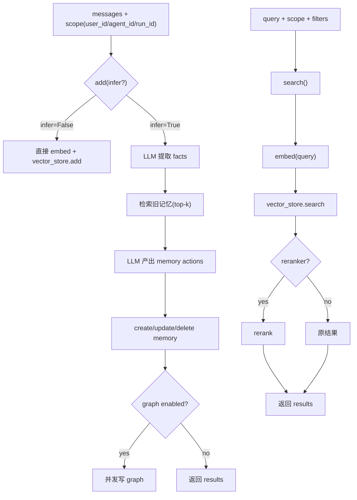

# Mem0 深度调研报告（Round 1 - Deep）

## 1. 这是什么（组件定位）

Mem0 是“可集成的长期记忆层”，核心不是一个 UI 产品，而是一套 SDK/服务能力：
- 写入：从消息中提炼并存储记忆（`add`）
- 检索：按 query + scope 拉回相关记忆（`search`）
- 可选图记忆：在向量记忆之外维护关系（graph store）

仓库与版本：
- Repo: `https://github.com/mem0ai/mem0`
- 本地 commit: `93c7203`

---

## 2. 怎么用（官方最小用法）

官方 README 最小示例（关键调用）是：
1. `memory = Memory()`
2. `memory.search(query=..., user_id=..., limit=...)`
3. `memory.add(messages, user_id=...)`

源码/文档定位：
- `/tmp/memory_scan_round2/mem0/README.md:98`
- `/tmp/memory_scan_round2/mem0/README.md:109`
- `/tmp/memory_scan_round2/mem0/README.md:113`
- `/tmp/memory_scan_round2/mem0/README.md:124`

---

## 3. 核心机制（怎么抽、怎么存、怎么取）

这一章只回答三件事：  
1) 对话如何变成 memory item（抽取）  
2) item 如何落到库里（存储）  
3) 查询如何命中 item（检索）

### 3.1 抽取机制（Extraction）

**输入对象**
- `messages`（str/dict/list 都可）
- 作用域：至少一个 `user_id / agent_id / run_id`
- `infer` 开关

**处理逻辑**
- `infer=False`：不做“理解式抽取”，消息直接进入存储路径。
- `infer=True`：先让 LLM 从对话里抽“可长期复用事实”，再决定动作：
  - `ADD` 新建记忆
  - `UPDATE` 更新已存在记忆
  - `DELETE` 删除过期或冲突记忆
- 如果开启 graph，抽取后会同时走向量记忆与图记忆两条写入线。

**输出对象**
- 一组 action 结果（每条至少包含 `id / memory / event`）。
- 从本次真实跑结果看，抽取内容是事实句子粒度，例如：
  - `最讨厌香菜的味道，闻到会反胃`
  - `订机票习惯选靠窗座位，喜欢看窗外的云`

**失败模式**
- 没带作用域：直接报错，不允许落库。
- `infer=True` 下，LLM 抽取偏“总结化”时，可能把细节压缩过头（召回时信息不够细）。

**最小例子**
- 输入：`"我现在喝拿铁，不喝冰美式了，胃不舒服"`
- 期望抽取：`ADD("之前喝冰美式，现在换成拿铁，因为胃不舒服")`

**代码证据（相对路径）**
- `mem0/memory/main.py:172`
- `mem0/memory/main.py:260`
- `mem0/memory/main.py:281`
- `mem0/memory/main.py:332`
- `mem0/memory/main.py:356`
- `mem0/memory/main.py:378`
- `mem0/memory/main.py:410`
- `mem0/memory/main.py:535`
- `mem0/memory/main.py:1075`

### 3.2 存储机制（Storage）

**输入对象**
- 抽取得到的 action + memory 文本
- scope（user/agent/run）
- metadata（可选）

**处理逻辑**
- Mem0 会把记忆写到向量存储，并在 SQLite 中保留历史轨迹（用于追踪变更与调试）。
- 核心是“按 scope 隔离”：
  - 同一个 `user_id` 的记忆互相关联
  - 不同 `user_id` 默认不互相污染
- 当出现更新/冲突时，依赖 action 语义执行 `UPDATE/DELETE`，而不是无脑追加。

**输出对象**
- 持久化的 memory item（可被后续 `search` 检索）。
- 对外返回本次写入事件列表（ADD/UPDATE/DELETE）。

**失败模式**
- scope 设计不当（例如多人共用同一个 user_id）会导致记忆串线。
- 只追加不更新会造成同义重复，增加后续排序噪声。

**最小例子**
- 第一次：`ADD("喜欢靠窗座位")`
- 后续新事实：`"现在更偏好过道座位"`  
  合理行为应是 `UPDATE` 或新增并标注时间，而非无限重复。

### 3.3 检索机制（Retrieval）

**输入对象**
- `query`
- scope（必需）
- filters（基础或高级布尔过滤）
- 可选 reranker

**处理逻辑**
- query 先 embedding，再做向量召回（top-k）。
- 如果启用 graph，会并行做图检索再合并。
- 如果启用 reranker，会在候选集合上二次排序，提升前排相关性。
- 支持高级过滤（AND/OR/NOT、比较操作），用于做“先筛再排”。

**输出对象**
- 命中列表（包含文本、分数、元数据等）。
- 在业务侧再决定注入多少条到主模型上下文。

**失败模式**
- 召回到了正确记忆但排序靠后：看起来像“没命中”，本质是 rank 问题。
- query 太泛会引入噪声；需要 filters 或 rerank 辅助。
- scope 选错会直接查到“别人的记忆”或查不到。

**最小例子**
- query：`"帮我点外卖，别踩雷"`
- 期望命中：`"最讨厌香菜"` 这类饮食偏好记忆。

**代码证据（相对路径）**
- `mem0/memory/main.py:758`
- `mem0/memory/main.py:833`
- `mem0/memory/main.py:882`
- `mem0/memory/main.py:892`
- `mem0/memory/main.py:940`
- `mem0/memory/main.py:954`
- `mem0/memory/main.py:976`

### 3.4 关键特性：Graph 与 Metadata（用了到底有什么收益）

| 特性 | 解决的问题 | 典型收益 | 代价/风险 | 适用场景 |
|---|---|---|---|---|
| `graph` | 仅靠向量相似度时，跨实体关系不好召回 | 对“人-关系-事件”类查询更稳（例如“我女朋友叫什么、上次计划去哪”） | 写入和检索链路更复杂，延迟和成本更高 | 关系型记忆密集（人物网络、计划依赖、多实体追踪） |
| `metadata` | 纯文本召回噪声大、难做精准筛选 | 可先过滤再召回，减少噪声（如按 `topic=work`、`time_range`） | 需要前置 schema 设计，不规范会失效 | 业务可定义结构化字段、需要可控检索 |

**Graph 模式的直观好处**
- 向量检索擅长“语义近似”，graph 擅长“关系路径”。
- 两者并行后再合并，通常能提升“关系问题”的命中率与排序稳定性。
- 例子：query=`我对象生日快到了，之前我提过去哪吗？`
  - 纯向量：可能命中“旅行”但排位不稳定。
  - 向量+graph：更容易把“小雨 -> 生日 -> 云南旅行计划”这一链路提前。

**Metadata 的直观好处**
- 不是让模型更聪明，而是让检索更可控。
- 例子：给记忆打 `category=food_preference`，query=`帮我点外卖` 时先过滤该类，再做 top-k，能显著减少“工作/旅行”噪声项。

**本次实验的观察（为什么你会觉得效果一般）**
- 这轮 Case13 跑出来的结果里，大量条目 `metadata: null`。
- 含义：我们实际只用了“文本+向量”主路径，没真正吃到 metadata 过滤红利。
- 结论：要验证 metadata 的真实价值，下一轮必须在写入时强制带结构化 metadata，再做 A/B（有过滤 vs 无过滤）。

**落地建议**
- 教学第一阶段：先用纯向量，讲清 add/search 基础行为。
- 教学第二阶段：加 metadata（低成本高收益，最先该做）。
- 教学第三阶段：再加 graph，对比“关系查询”质量提升是否值得成本。

### 3.5 卖点验证方案（与测试脚本对齐）

为了避免“只看文档卖点”，本报告要求卖点必须对应可执行 probe。  
当前 Mem0 已落地到脚本：`tests/research/memory/run_mem0_rich_demo_real.py`（默认执行卖点 probes）。

| 卖点 | 机制依据 | Probe 设计 | 看什么结果 |
|---|---|---|---|
| `infer=True` 的抽取/归并能力 | LLM 抽 facts + ADD/UPDATE/DELETE action | 同一 Case13 分别 `infer=True` 与 `infer=False` 写入，再跑同一组 Query-1..8 | 关键记忆命中率（关键词命中）谁更高 |
| metadata + filters 的可控检索 | 写入 metadata，检索时先过滤后召回 | 构造多 topic 记忆，比较 `no_filter` vs `filters={"topic":{"eq":"food_preference"}}` | 噪声项是否减少、目标项是否前移 |
| graph 的关系增强（后续） | 向量召回并行图检索并合并 | 同 query 比较 graph off/on（需要图后端） | 关系型问题（人物-事件-计划）命中率/排序是否提升 |

说明：
- 前两项已在脚本内直接可跑。
- 第三项依赖图后端环境，作为下一阶段 probe（不在本轮默认脚本中强开）。

---

## 4. 流程图（教学版）



---

## 5. 真实验证（本轮执行结果）

### 5.1 执行命令（Case13 对齐 MemU）

```bash
/Users/admin/miniconda3/envs/py312/bin/python /Users/admin/work/agent_loop/tests/research/memory/run_mem0_rich_demo_real.py \
  --config /Users/admin/work/agent_loop/configs/default.json \
  --benchmark-path /Users/admin/work/agent_loop/tests/research/memory/data/agent_memory_case13_shared.md \
  --benchmark-case auto \
  --retrieve-query-set daily_habits
```

### 5.2 完整结果（原始对话 + memorize 抽取 + Query-1..8 检索原文）

```text
=== INPUT DIALOGUE (FULL) ===
01. (user) 嗨，在吗？
02. (assistant) 在的，怎么了？
03. (user) 没啥，就是刚换了工作，有点兴奋又有点慌，想找人说说话。
04. (assistant) 换新工作是大事！恭喜你。是什么样的工作呀？
05. (user) 一家叫"星云科技"的公司，做AI机器人相关的项目，我在里面做产品经理，我叫李明。
06. (assistant) 李明你好！AI机器人，听起来就很酷，星云科技是做什么方向的机器人？
07. (user) 主要是工业场景的自动化，说起来挺复杂的，以后有机会再聊。你最近怎么样？
08. (assistant) 我挺好的，谢谢关心。你刚入职，有没有什么不适应的地方？
09. (user) 还好，同事都挺好的。就是任务量有点大，上来就给我压了个新项目。
10. (assistant) 新人嘛，往往都是这样，先扛住，等熟悉了就好了。
11. (user) 是这个道理。对了，你知道最近有什么好看的剧吗？我想下班回家放松一下。
12. (assistant) 最近《繁花》口碑很好，是王家卫导演的，讲上海九十年代的商战故事，画面很有质感。
13. (user) 哦？王家卫的剧？那画面肯定很美，我加到片单里了。
14. (assistant) 对，每一帧都像电影，你应该会喜欢。
15. (user) 好。我先去忙了，下班再聊。
16. (assistant) 好的，下班见！
17. (user) 我回来了，累死了。今天中午点外卖踩雷了，心情还没缓过来。
18. (assistant) 哎，怎么了？
19. (user) 点了碗牛肉粉，结果老板给我放了一大把香菜，我最讨厌那个味道了，闻到就反胃，整碗都没吃。
20. (assistant) 这也太倒霉了，白白浪费了一顿饭。以后点餐一定要在备注里写清楚。
21. (user) 对，我已经长记性了。不说这个了，我回家看了会儿我家猫，心情好多了。
22. (assistant) 你养猫啊？什么品种的？
23. (user) 布偶猫，我给它取名叫"奶油"，因为它毛茸茸的，颜色也是奶白色的，看着就想揉。
24. (assistant) 奶油！这名字太贴切了，布偶猫的毛真的很像奶油的质感。
25. (user) 哈哈，就是这个感觉。它最近好像有点无聊，我想给它买个新玩具。
26. (assistant) 猫咪都喜欢有新鲜感的东西，可以试试电动的逗猫棒，或者那种有小球在轨道里滚的玩具，布偶猫一般都很喜欢追。
27. (user) 好主意，我去看看。
28. (assistant) 好的，希望奶油喜欢。
29. (user) 说起来，我下周要在公司内部做个技术分享，还没想好讲什么，你帮我出出主意？
30. (assistant) 你在AI公司做产品，可以讲的角度很多。比如从产品视角看AI落地的难点，或者某个具体的技术方向的科普？
31. (user) 我最近在研究机器学习相关的东西，要不就讲这个？感觉大家都挺感兴趣的。
32. (assistant) 机器学习这个主题很好，既有深度又有广度，受众也广。定了的话，我可以帮你整理一些资料。
33. (user) 好，就定这个了。谢谢。
34. (assistant) 没问题，等你准备的时候跟我说。
35. (user) 嗯。对了，我女朋友叫小雨，下个月生日，我完全不知道送什么好。
36. (assistant) 送女朋友礼物确实是个难题。小雨平时有什么特别的爱好吗？
37. (user) 她好像什么都还好，不太挑。
38. (assistant) 那可以从体验类礼物入手，比如一次精致的下午茶、一场她喜欢的演唱会，或者一次旅行，都比实物更有记忆点。
39. (user) 旅行！我之前就说要带她去云南玩，一直没成行，要不借这个机会？
40. (assistant) 这个主意太好了，云南风景美，而且现在去天气也舒服，肯定是个大惊喜。
41. (user) 行，我去查查机票。我订票有个习惯，就是必须选靠窗的座位，喜欢看窗外的云，感觉很解压。
42. (assistant) 这个习惯很好，靠窗的视野确实不一样。
43. (user) 对。不过说起来，我上个月刚从北京搬到上海，人生地不熟的，还在适应。
44. (assistant) 哦，北京到上海，变化挺大的。气候、饮食、生活节奏都不一样，慢慢来。
45. (user) 气候好多了，没那么干燥。就是饮食还在摸索，上海的口味偏甜，我还不太习惯。
46. (assistant) 慢慢就习惯了，而且上海各地的菜系都有，总能找到合适的。
47. (user) 也是。对了，我最近喝咖啡的习惯也改了，以前早上必须一杯冰美式，现在喝完胃不舒服，换成拿铁了。
48. (assistant) 身体在提醒你了，拿铁因为加了奶，确实对肠胃更友好。
49. (user) 对，而且喝起来也没那么苦，我反而觉得还挺好喝的。
50. (assistant) 那就找到新的日常了，挺好的。
51. (user) 哈哈。好了，我要开始准备分享会了。我这里有份用户行为数据（user_data.csv），我想先分析一下，看看大家对哪些功能更感兴趣，好在分享会上举例子。
52. (assistant) 这个思路很好，有数据支撑的分享会会更有说服力。
53. (user) 我习惯用Python来做这类分析，你帮我写个读取和分析的脚本框架吧。
54. (assistant) 没问题，用Pandas读取CSV，然后用Matplotlib做可视化，这是最常用的组合。框架代码如下：`import pandas as pd; import matplotlib.pyplot as plt; df = pd.read_csv(\'user_data.csv\'); print(df.describe())` 你可以在这个基础上继续完善。
55. (user) 很好，我来完善一下。
56. (assistant) 好的，有问题随时问我。
57. (user) 好了，代码跑完了，数据挺有意思的。我到家了，顺手把钥匙挂在厨房门后的挂钩上了。
58. (assistant) 好的，钥匙在厨房门后的挂钩上，记住了。
59. (user) 我现在打开电脑，开了Chrome、Slack和VSCode，在VSCode里打开了`app.py`，准备继续写代码。
60. (assistant) 好的，当前在VSCode里看`app.py`。
61. (user) 嗯，先在Slack里回一下消息。
62. (assistant) 好的。

[STEP] detect embedding dims
[EMBED] using fixed dims=1024 base_url=https://open.bigmodel.cn/api/paas/v4

=== MEMORIZE REQUEST ===
{
  "user_id": "u_real_demo_mem0_001",
  "messages": [
    {
      "role": "user",
      "content": "嗨，在吗？"
    },
    {
      "role": "assistant",
      "content": "在的，怎么了？"
    },
    {
      "role": "user",
      "content": "没啥，就是刚换了工作，有点兴奋又有点慌，想找人说说话。"
    },
    {
      "role": "assistant",
      "content": "换新工作是大事！恭喜你。是什么样的工作呀？"
    },
    {
      "role": "user",
      "content": "一家叫\"星云科技\"的公司，做AI机器人相关的项目，我在里面做产品经理，我叫李明。"
    },
    {
      "role": "assistant",
      "content": "李明你好！AI机器人，听起来就很酷，星云科技是做什么方向的机器人？"
    },
    {
      "role": "user",
      "content": "主要是工业场景的自动化，说起来挺复杂的，以后有机会再聊。你最近怎么样？"
    },
    {
      "role": "assistant",
      "content": "我挺好的，谢谢关心。你刚入职，有没有什么不适应的地方？"
    },
    {
      "role": "user",
      "content": "还好，同事都挺好的。就是任务量有点大，上来就给我压了个新项目。"
    },
    {
      "role": "assistant",
      "content": "新人嘛，往往都是这样，先扛住，等熟悉了就好了。"
    },
    {
      "role": "user",
      "content": "是这个道理。对了，你知道最近有什么好看的剧吗？我想下班回家放松一下。"
    },
    {
      "role": "assistant",
      "content": "最近《繁花》口碑很好，是王家卫导演的，讲上海九十年代的商战故事，画面很有质感。"
    },
    {
      "role": "user",
      "content": "哦？王家卫的剧？那画面肯定很美，我加到片单里了。"
    },
    {
      "role": "assistant",
      "content": "对，每一帧都像电影，你应该会喜欢。"
    },
    {
      "role": "user",
      "content": "好。我先去忙了，下班再聊。"
    },
    {
      "role": "assistant",
      "content": "好的，下班见！"
    },
    {
      "role": "user",
      "content": "我回来了，累死了。今天中午点外卖踩雷了，心情还没缓过来。"
    },
    {
      "role": "assistant",
      "content": "哎，怎么了？"
    },
    {
      "role": "user",
      "content": "点了碗牛肉粉，结果老板给我放了一大把香菜，我最讨厌那个味道了，闻到就反胃，整碗都没吃。"
    },
    {
      "role": "assistant",
      "content": "这也太倒霉了，白白浪费了一顿饭。以后点餐一定要在备注里写清楚。"
    },
    {
      "role": "user",
      "content": "对，我已经长记性了。不说这个了，我回家看了会儿我家猫，心情好多了。"
    },
    {
      "role": "assistant",
      "content": "你养猫啊？什么品种的？"
    },
    {
      "role": "user",
      "content": "布偶猫，我给它取名叫\"奶油\"，因为它毛茸茸的，颜色也是奶白色的，看着就想揉。"
    },
    {
      "role": "assistant",
      "content": "奶油！这名字太贴切了，布偶猫的毛真的很像奶油的质感。"
    },
    {
      "role": "user",
      "content": "哈哈，就是这个感觉。它最近好像有点无聊，我想给它买个新玩具。"
    },
    {
      "role": "assistant",
      "content": "猫咪都喜欢有新鲜感的东西，可以试试电动的逗猫棒，或者那种有小球在轨道里滚的玩具，布偶猫一般都很喜欢追。"
    },
    {
      "role": "user",
      "content": "好主意，我去看看。"
    },
    {
      "role": "assistant",
      "content": "好的，希望奶油喜欢。"
    },
    {
      "role": "user",
      "content": "说起来，我下周要在公司内部做个技术分享，还没想好讲什么，你帮我出出主意？"
    },
    {
      "role": "assistant",
      "content": "你在AI公司做产品，可以讲的角度很多。比如从产品视角看AI落地的难点，或者某个具体的技术方向的科普？"
    },
    {
      "role": "user",
      "content": "我最近在研究机器学习相关的东西，要不就讲这个？感觉大家都挺感兴趣的。"
    },
    {
      "role": "assistant",
      "content": "机器学习这个主题很好，既有深度又有广度，受众也广。定了的话，我可以帮你整理一些资料。"
    },
    {
      "role": "user",
      "content": "好，就定这个了。谢谢。"
    },
    {
      "role": "assistant",
      "content": "没问题，等你准备的时候跟我说。"
    },
    {
      "role": "user",
      "content": "嗯。对了，我女朋友叫小雨，下个月生日，我完全不知道送什么好。"
    },
    {
      "role": "assistant",
      "content": "送女朋友礼物确实是个难题。小雨平时有什么特别的爱好吗？"
    },
    {
      "role": "user",
      "content": "她好像什么都还好，不太挑。"
    },
    {
      "role": "assistant",
      "content": "那可以从体验类礼物入手，比如一次精致的下午茶、一场她喜欢的演唱会，或者一次旅行，都比实物更有记忆点。"
    },
    {
      "role": "user",
      "content": "旅行！我之前就说要带她去云南玩，一直没成行，要不借这个机会？"
    },
    {
      "role": "assistant",
      "content": "这个主意太好了，云南风景美，而且现在去天气也舒服，肯定是个大惊喜。"
    },
    {
      "role": "user",
      "content": "行，我去查查机票。我订票有个习惯，就是必须选靠窗的座位，喜欢看窗外的云，感觉很解压。"
    },
    {
      "role": "assistant",
      "content": "这个习惯很好，靠窗的视野确实不一样。"
    },
    {
      "role": "user",
      "content": "对。不过说起来，我上个月刚从北京搬到上海，人生地不熟的，还在适应。"
    },
    {
      "role": "assistant",
      "content": "哦，北京到上海，变化挺大的。气候、饮食、生活节奏都不一样，慢慢来。"
    },
    {
      "role": "user",
      "content": "气候好多了，没那么干燥。就是饮食还在摸索，上海的口味偏甜，我还不太习惯。"
    },
    {
      "role": "assistant",
      "content": "慢慢就习惯了，而且上海各地的菜系都有，总能找到合适的。"
    },
    {
      "role": "user",
      "content": "也是。对了，我最近喝咖啡的习惯也改了，以前早上必须一杯冰美式，现在喝完胃不舒服，换成拿铁了。"
    },
    {
      "role": "assistant",
      "content": "身体在提醒你了，拿铁因为加了奶，确实对肠胃更友好。"
    },
    {
      "role": "user",
      "content": "对，而且喝起来也没那么苦，我反而觉得还挺好喝的。"
    },
    {
      "role": "assistant",
      "content": "那就找到新的日常了，挺好的。"
    },
    {
      "role": "user",
      "content": "哈哈。好了，我要开始准备分享会了。我这里有份用户行为数据（user_data.csv），我想先分析一下，看看大家对哪些功能更感兴趣，好在分享会上举例子。"
    },
    {
      "role": "assistant",
      "content": "这个思路很好，有数据支撑的分享会会更有说服力。"
    },
    {
      "role": "user",
      "content": "我习惯用Python来做这类分析，你帮我写个读取和分析的脚本框架吧。"
    },
    {
      "role": "assistant",
      "content": "没问题，用Pandas读取CSV，然后用Matplotlib做可视化，这是最常用的组合。框架代码如下：`import pandas as pd; import matplotlib.pyplot as plt; df = pd.read_csv(\\'user_data.csv\\'); print(df.describe())` 你可以在这个基础上继续完善。"
    },
    {
      "role": "user",
      "content": "很好，我来完善一下。"
    },
    {
      "role": "assistant",
      "content": "好的，有问题随时问我。"
    },
    {
      "role": "user",
      "content": "好了，代码跑完了，数据挺有意思的。我到家了，顺手把钥匙挂在厨房门后的挂钩上了。"
    },
    {
      "role": "assistant",
      "content": "好的，钥匙在厨房门后的挂钩上，记住了。"
    },
    {
      "role": "user",
      "content": "我现在打开电脑，开了Chrome、Slack和VSCode，在VSCode里打开了`app.py`，准备继续写代码。"
    },
    {
      "role": "assistant",
      "content": "好的，当前在VSCode里看`app.py`。"
    },
    {
      "role": "user",
      "content": "嗯，先在Slack里回一下消息。"
    },
    {
      "role": "assistant",
      "content": "好的。"
    }
  ]
}

=== MEMORIZE RESULT ===
{
  "results": [
    {
      "id": "441aa928-1c90-4a64-8ea4-4eaee68a6511",
      "memory": "姓名是李明",
      "event": "ADD"
    },
    {
      "id": "d9680024-c7fb-4f2e-8cc1-9e893eea95f7",
      "memory": "刚换到星云科技公司工作，担任产品经理，从事AI机器人相关项目",
      "event": "ADD"
    },
    {
      "id": "f1f5dd56-2f18-4f63-bd65-faf7f5d64f3c",
      "memory": "公司主要做工业场景的自动化",
      "event": "ADD"
    },
    {
      "id": "c41d7145-6202-46c2-a29f-9670e976cbdb",
      "memory": "从北京搬到上海不久",
      "event": "ADD"
    },
    {
      "id": "6f0bd5c8-dea3-4981-99e8-4614aaa29c11",
      "memory": "上海口味偏甜，还不太习惯",
      "event": "ADD"
    },
    {
      "id": "191819ca-90a6-440e-9749-3cda6d726b4d",
      "memory": "之前喝冰美式，现在换成拿铁，因为喝完胃不舒服",
      "event": "ADD"
    },
    {
      "id": "e217612c-0b2d-4d03-93be-60557dddd197",
      "memory": "有女朋友叫小雨，下个月生日，计划带她去云南旅行",
      "event": "ADD"
    },
    {
      "id": "820acb67-0fce-4ae5-9cce-f24ff4b63840",
      "memory": "订机票习惯选靠窗座位，喜欢看窗外的云",
      "event": "ADD"
    },
    {
      "id": "795b0a8b-134f-4fbd-b396-3f58f574ab45",
      "memory": "养了一只布偶猫名叫奶油",
      "event": "ADD"
    },
    {
      "id": "e99b1949-2cdd-4891-a814-a138307e9855",
      "memory": "最讨厌香菜的味道，闻到会反胃",
      "event": "ADD"
    },
    {
      "id": "961acc65-0079-4168-8156-4e1b95136bd0",
      "memory": "下周要在公司内部做技术分享，主题是机器学习",
      "event": "ADD"
    },
    {
      "id": "93d3dfa8-d256-4d3a-a3e9-2f2afcc51879",
      "memory": "用Python做数据分析",
      "event": "ADD"
    },
    {
      "id": "21cdcfd1-244b-4678-9c7f-0c42f5503bb5",
      "memory": "回家后把钥匙挂在厨房门后的挂钩上",
      "event": "ADD"
    },
    {
      "id": "b3e36a1e-da05-4e93-98c3-f5da78ed5bf3",
      "memory": "常用的开发工具是Chrome、Slack和VSCode",
      "event": "ADD"
    }
  ]
}

=== RETRIEVE SUMMARY ===
total_cases=8

=== RETRIEVE CASE 1/8: Query-1 ===
query: 我中午想吃煎饼，帮我下个单。
result:
{
  "results": [
    {
      "id": "961acc65-0079-4168-8156-4e1b95136bd0",
      "memory": "下周要在公司内部做技术分享，主题是机器学习",
      "hash": "87116cb1b6483db53ee7e05fc5a37338",
      "metadata": null,
      "score": 0.5302340091562157,
      "created_at": "2026-02-27T19:11:06.949862-08:00",
      "updated_at": null,
      "user_id": "u_real_demo_mem0_001"
    },
    {
      "id": "820acb67-0fce-4ae5-9cce-f24ff4b63840",
      "memory": "订机票习惯选靠窗座位，喜欢看窗外的云",
      "hash": "efdbcc37984a961ba8f5de511cccfeca",
      "metadata": null,
      "score": 0.5285752736662668,
      "created_at": "2026-02-27T19:11:06.945766-08:00",
      "updated_at": null,
      "user_id": "u_real_demo_mem0_001"
    },
    {
      "id": "6f0bd5c8-dea3-4981-99e8-4614aaa29c11",
      "memory": "上海口味偏甜，还不太习惯",
      "hash": "c8ad670d764f0463881dda9183e202a5",
      "metadata": null,
      "score": 0.5238068296593016,
      "created_at": "2026-02-27T19:11:06.939649-08:00",
      "updated_at": null,
      "user_id": "u_real_demo_mem0_001"
    },
    {
      "id": "c41d7145-6202-46c2-a29f-9670e976cbdb",
      "memory": "从北京搬到上海不久",
      "hash": "853b71f8f53840693bacb2e0dbe690a0",
      "metadata": null,
      "score": 0.5188208883142429,
      "created_at": "2026-02-27T19:11:06.935132-08:00",
      "updated_at": null,
      "user_id": "u_real_demo_mem0_001"
    },
    {
      "id": "e217612c-0b2d-4d03-93be-60557dddd197",
      "memory": "有女朋友叫小雨，下个月生日，计划带她去云南旅行",
      "hash": "ae43f9fc0b405916ddcda67f06b7e826",
      "metadata": null,
      "score": 0.5154484559675051,
      "created_at": "2026-02-27T19:11:06.944403-08:00",
      "updated_at": null,
      "user_id": "u_real_demo_mem0_001"
    },
    {
      "id": "441aa928-1c90-4a64-8ea4-4eaee68a6511",
      "memory": "姓名是李明",
      "hash": "fac489c4addc99c5dfbe4d24d582984a",
      "metadata": null,
      "score": 0.5120670790682369,
      "created_at": "2026-02-27T19:11:06.919290-08:00",
      "updated_at": null,
      "user_id": "u_real_demo_mem0_001"
    },
    {
      "id": "d9680024-c7fb-4f2e-8cc1-9e893eea95f7",
      "memory": "刚换到星云科技公司工作，担任产品经理，从事AI机器人相关项目",
      "hash": "db6a39a69c6093c28c194d06dad1e236",
      "metadata": null,
      "score": 0.5101722574592605,
      "created_at": "2026-02-27T19:11:06.926684-08:00",
      "updated_at": null,
      "user_id": "u_real_demo_mem0_001"
    },
    {
      "id": "f1f5dd56-2f18-4f63-bd65-faf7f5d64f3c",
      "memory": "公司主要做工业场景的自动化",
      "hash": "dbe7c37d047b5c8399a8cdb56324808d",
      "metadata": null,
      "score": 0.5019968579595129,
      "created_at": "2026-02-27T19:11:06.931591-08:00",
      "updated_at": null,
      "user_id": "u_real_demo_mem0_001"
    }
  ]
}

=== RETRIEVE CASE 2/8: Query-2 ===
query: 给我推荐个咖啡。
result:
{
  "results": [
    {
      "id": "191819ca-90a6-440e-9749-3cda6d726b4d",
      "memory": "之前喝冰美式，现在换成拿铁，因为喝完胃不舒服",
      "hash": "705ba82615037142f00b4e9dec496141",
      "metadata": null,
      "score": 0.6026211041296738,
      "created_at": "2026-02-27T19:11:06.942136-08:00",
      "updated_at": null,
      "user_id": "u_real_demo_mem0_001"
    },
    {
      "id": "6f0bd5c8-dea3-4981-99e8-4614aaa29c11",
      "memory": "上海口味偏甜，还不太习惯",
      "hash": "c8ad670d764f0463881dda9183e202a5",
      "metadata": null,
      "score": 0.573231459304597,
      "created_at": "2026-02-27T19:11:06.939649-08:00",
      "updated_at": null,
      "user_id": "u_real_demo_mem0_001"
    },
    {
      "id": "795b0a8b-134f-4fbd-b396-3f58f574ab45",
      "memory": "养了一只布偶猫名叫奶油",
      "hash": "13a2f81252f4d130bd8b8aebc307df2d",
      "metadata": null,
      "score": 0.5641410475345453,
      "created_at": "2026-02-27T19:11:06.947385-08:00",
      "updated_at": null,
      "user_id": "u_real_demo_mem0_001"
    },
    {
      "id": "c41d7145-6202-46c2-a29f-9670e976cbdb",
      "memory": "从北京搬到上海不久",
      "hash": "853b71f8f53840693bacb2e0dbe690a0",
      "metadata": null,
      "score": 0.535794177962372,
      "created_at": "2026-02-27T19:11:06.935132-08:00",
      "updated_at": null,
      "user_id": "u_real_demo_mem0_001"
    },
    {
      "id": "441aa928-1c90-4a64-8ea4-4eaee68a6511",
      "memory": "姓名是李明",
      "hash": "fac489c4addc99c5dfbe4d24d582984a",
      "metadata": null,
      "score": 0.5280577321934573,
      "created_at": "2026-02-27T19:11:06.919290-08:00",
      "updated_at": null,
      "user_id": "u_real_demo_mem0_001"
    },
    {
      "id": "d9680024-c7fb-4f2e-8cc1-9e893eea95f7",
      "memory": "刚换到星云科技公司工作，担任产品经理，从事AI机器人相关项目",
      "hash": "db6a39a69c6093c28c194d06dad1e236",
      "metadata": null,
      "score": 0.5256466462116889,
      "created_at": "2026-02-27T19:11:06.926684-08:00",
      "updated_at": null,
      "user_id": "u_real_demo_mem0_001"
    },
    {
      "id": "f1f5dd56-2f18-4f63-bd65-faf7f5d64f3c",
      "memory": "公司主要做工业场景的自动化",
      "hash": "dbe7c37d047b5c8399a8cdb56324808d",
      "metadata": null,
      "score": 0.5219354563425453,
      "created_at": "2026-02-27T19:11:06.931591-08:00",
      "updated_at": null,
      "user_id": "u_real_demo_mem0_001"
    },
    {
      "id": "961acc65-0079-4168-8156-4e1b95136bd0",
      "memory": "下周要在公司内部做技术分享，主题是机器学习",
      "hash": "87116cb1b6483db53ee7e05fc5a37338",
      "metadata": null,
      "score": 0.5214251232778506,
      "created_at": "2026-02-27T19:11:06.949862-08:00",
      "updated_at": null,
      "user_id": "u_real_demo_mem0_001"
    }
  ]
}

=== RETRIEVE CASE 3/8: Query-3 ===
query: 我昨天被我家猫挠了一下，怎么处理比较稳妥。
result:
{
  "results": [
    {
      "id": "795b0a8b-134f-4fbd-b396-3f58f574ab45",
      "memory": "养了一只布偶猫名叫奶油",
      "hash": "13a2f81252f4d130bd8b8aebc307df2d",
      "metadata": null,
      "score": 0.6205869442923968,
      "created_at": "2026-02-27T19:11:06.947385-08:00",
      "updated_at": null,
      "user_id": "u_real_demo_mem0_001"
    },
    {
      "id": "21cdcfd1-244b-4678-9c7f-0c42f5503bb5",
      "memory": "回家后把钥匙挂在厨房门后的挂钩上",
      "hash": "787aac2307dd932a463be63777c76cc4",
      "metadata": null,
      "score": 0.5420527817847428,
      "created_at": "2026-02-27T19:11:06.952760-08:00",
      "updated_at": null,
      "user_id": "u_real_demo_mem0_001"
    },
    {
      "id": "e99b1949-2cdd-4891-a814-a138307e9855",
      "memory": "最讨厌香菜的味道，闻到会反胃",
      "hash": "4894ee533a2fe44247b4b499c16647bf",
      "metadata": null,
      "score": 0.5130689210878205,
      "created_at": "2026-02-27T19:11:06.948738-08:00",
      "updated_at": null,
      "user_id": "u_real_demo_mem0_001"
    },
    {
      "id": "6f0bd5c8-dea3-4981-99e8-4614aaa29c11",
      "memory": "上海口味偏甜，还不太习惯",
      "hash": "c8ad670d764f0463881dda9183e202a5",
      "metadata": null,
      "score": 0.5010670817524263,
      "created_at": "2026-02-27T19:11:06.939649-08:00",
      "updated_at": null,
      "user_id": "u_real_demo_mem0_001"
    },
    {
      "id": "e217612c-0b2d-4d03-93be-60557dddd197",
      "memory": "有女朋友叫小雨，下个月生日，计划带她去云南旅行",
      "hash": "ae43f9fc0b405916ddcda67f06b7e826",
      "metadata": null,
      "score": 0.49309857291010184,
      "created_at": "2026-02-27T19:11:06.944403-08:00",
      "updated_at": null,
      "user_id": "u_real_demo_mem0_001"
    },
    {
      "id": "c41d7145-6202-46c2-a29f-9670e976cbdb",
      "memory": "从北京搬到上海不久",
      "hash": "853b71f8f53840693bacb2e0dbe690a0",
      "metadata": null,
      "score": 0.48869832593807205,
      "created_at": "2026-02-27T19:11:06.935132-08:00",
      "updated_at": null,
      "user_id": "u_real_demo_mem0_001"
    },
    {
      "id": "f1f5dd56-2f18-4f63-bd65-faf7f5d64f3c",
      "memory": "公司主要做工业场景的自动化",
      "hash": "dbe7c37d047b5c8399a8cdb56324808d",
      "metadata": null,
      "score": 0.48294550809362724,
      "created_at": "2026-02-27T19:11:06.931591-08:00",
      "updated_at": null,
      "user_id": "u_real_demo_mem0_001"
    },
    {
      "id": "441aa928-1c90-4a64-8ea4-4eaee68a6511",
      "memory": "姓名是李明",
      "hash": "fac489c4addc99c5dfbe4d24d582984a",
      "metadata": null,
      "score": 0.4790966373081698,
      "created_at": "2026-02-27T19:11:06.919290-08:00",
      "updated_at": null,
      "user_id": "u_real_demo_mem0_001"
    }
  ]
}

=== RETRIEVE CASE 4/8: Query-4 ===
query: 我想跳槽，先按我的背景给我起一版简历大纲我看看看。
result:
{
  "results": [
    {
      "id": "d9680024-c7fb-4f2e-8cc1-9e893eea95f7",
      "memory": "刚换到星云科技公司工作，担任产品经理，从事AI机器人相关项目",
      "hash": "db6a39a69c6093c28c194d06dad1e236",
      "metadata": null,
      "score": 0.6266082060311712,
      "created_at": "2026-02-27T19:11:06.926684-08:00",
      "updated_at": null,
      "user_id": "u_real_demo_mem0_001"
    },
    {
      "id": "f1f5dd56-2f18-4f63-bd65-faf7f5d64f3c",
      "memory": "公司主要做工业场景的自动化",
      "hash": "dbe7c37d047b5c8399a8cdb56324808d",
      "metadata": null,
      "score": 0.5849474679591407,
      "created_at": "2026-02-27T19:11:06.931591-08:00",
      "updated_at": null,
      "user_id": "u_real_demo_mem0_001"
    },
    {
      "id": "961acc65-0079-4168-8156-4e1b95136bd0",
      "memory": "下周要在公司内部做技术分享，主题是机器学习",
      "hash": "87116cb1b6483db53ee7e05fc5a37338",
      "metadata": null,
      "score": 0.5732781704426739,
      "created_at": "2026-02-27T19:11:06.949862-08:00",
      "updated_at": null,
      "user_id": "u_real_demo_mem0_001"
    },
    {
      "id": "c41d7145-6202-46c2-a29f-9670e976cbdb",
      "memory": "从北京搬到上海不久",
      "hash": "853b71f8f53840693bacb2e0dbe690a0",
      "metadata": null,
      "score": 0.5652199385568851,
      "created_at": "2026-02-27T19:11:06.935132-08:00",
      "updated_at": null,
      "user_id": "u_real_demo_mem0_001"
    },
    {
      "id": "441aa928-1c90-4a64-8ea4-4eaee68a6511",
      "memory": "姓名是李明",
      "hash": "fac489c4addc99c5dfbe4d24d582984a",
      "metadata": null,
      "score": 0.551373845616812,
      "created_at": "2026-02-27T19:11:06.919290-08:00",
      "updated_at": null,
      "user_id": "u_real_demo_mem0_001"
    },
    {
      "id": "6f0bd5c8-dea3-4981-99e8-4614aaa29c11",
      "memory": "上海口味偏甜，还不太习惯",
      "hash": "c8ad670d764f0463881dda9183e202a5",
      "metadata": null,
      "score": 0.5248464737279352,
      "created_at": "2026-02-27T19:11:06.939649-08:00",
      "updated_at": null,
      "user_id": "u_real_demo_mem0_001"
    },
    {
      "id": "e217612c-0b2d-4d03-93be-60557dddd197",
      "memory": "有女朋友叫小雨，下个月生日，计划带她去云南旅行",
      "hash": "ae43f9fc0b405916ddcda67f06b7e826",
      "metadata": null,
      "score": 0.520160465016889,
      "created_at": "2026-02-27T19:11:06.944403-08:00",
      "updated_at": null,
      "user_id": "u_real_demo_mem0_001"
    },
    {
      "id": "93d3dfa8-d256-4d3a-a3e9-2f2afcc51879",
      "memory": "用Python做数据分析",
      "hash": "f0546a8aaf71529ef3a1ea645e622dbd",
      "metadata": null,
      "score": 0.5097463987654143,
      "created_at": "2026-02-27T19:11:06.951214-08:00",
      "updated_at": null,
      "user_id": "u_real_demo_mem0_001"
    }
  ]
}

=== RETRIEVE CASE 5/8: Query-5 ===
query: 下周分享会我还没想好开场，按我定过的方向给个题目和提纲。
result:
{
  "results": [
    {
      "id": "961acc65-0079-4168-8156-4e1b95136bd0",
      "memory": "下周要在公司内部做技术分享，主题是机器学习",
      "hash": "87116cb1b6483db53ee7e05fc5a37338",
      "metadata": null,
      "score": 0.7479048395096904,
      "created_at": "2026-02-27T19:11:06.949862-08:00",
      "updated_at": null,
      "user_id": "u_real_demo_mem0_001"
    },
    {
      "id": "f1f5dd56-2f18-4f63-bd65-faf7f5d64f3c",
      "memory": "公司主要做工业场景的自动化",
      "hash": "dbe7c37d047b5c8399a8cdb56324808d",
      "metadata": null,
      "score": 0.5635496706663998,
      "created_at": "2026-02-27T19:11:06.931591-08:00",
      "updated_at": null,
      "user_id": "u_real_demo_mem0_001"
    },
    {
      "id": "d9680024-c7fb-4f2e-8cc1-9e893eea95f7",
      "memory": "刚换到星云科技公司工作，担任产品经理，从事AI机器人相关项目",
      "hash": "db6a39a69c6093c28c194d06dad1e236",
      "metadata": null,
      "score": 0.5530539446820214,
      "created_at": "2026-02-27T19:11:06.926684-08:00",
      "updated_at": null,
      "user_id": "u_real_demo_mem0_001"
    },
    {
      "id": "e217612c-0b2d-4d03-93be-60557dddd197",
      "memory": "有女朋友叫小雨，下个月生日，计划带她去云南旅行",
      "hash": "ae43f9fc0b405916ddcda67f06b7e826",
      "metadata": null,
      "score": 0.5373817239494718,
      "created_at": "2026-02-27T19:11:06.944403-08:00",
      "updated_at": null,
      "user_id": "u_real_demo_mem0_001"
    },
    {
      "id": "441aa928-1c90-4a64-8ea4-4eaee68a6511",
      "memory": "姓名是李明",
      "hash": "fac489c4addc99c5dfbe4d24d582984a",
      "metadata": null,
      "score": 0.5230515712292874,
      "created_at": "2026-02-27T19:11:06.919290-08:00",
      "updated_at": null,
      "user_id": "u_real_demo_mem0_001"
    },
    {
      "id": "6f0bd5c8-dea3-4981-99e8-4614aaa29c11",
      "memory": "上海口味偏甜，还不太习惯",
      "hash": "c8ad670d764f0463881dda9183e202a5",
      "metadata": null,
      "score": 0.5161405915795316,
      "created_at": "2026-02-27T19:11:06.939649-08:00",
      "updated_at": null,
      "user_id": "u_real_demo_mem0_001"
    },
    {
      "id": "93d3dfa8-d256-4d3a-a3e9-2f2afcc51879",
      "memory": "用Python做数据分析",
      "hash": "f0546a8aaf71529ef3a1ea645e622dbd",
      "metadata": null,
      "score": 0.514688498609611,
      "created_at": "2026-02-27T19:11:06.951214-08:00",
      "updated_at": null,
      "user_id": "u_real_demo_mem0_001"
    },
    {
      "id": "21cdcfd1-244b-4678-9c7f-0c42f5503bb5",
      "memory": "回家后把钥匙挂在厨房门后的挂钩上",
      "hash": "787aac2307dd932a463be63777c76cc4",
      "metadata": null,
      "score": 0.5118301484425096,
      "created_at": "2026-02-27T19:11:06.952760-08:00",
      "updated_at": null,
      "user_id": "u_real_demo_mem0_001"
    }
  ]
}

=== RETRIEVE CASE 6/8: Query-6 ===
query: 我明天去杭州，帮我列个订票要点清单，尤其座位怎么选。
result:
{
  "results": [
    {
      "id": "820acb67-0fce-4ae5-9cce-f24ff4b63840",
      "memory": "订机票习惯选靠窗座位，喜欢看窗外的云",
      "hash": "efdbcc37984a961ba8f5de511cccfeca",
      "metadata": null,
      "score": 0.6739440984788488,
      "created_at": "2026-02-27T19:11:06.945766-08:00",
      "updated_at": null,
      "user_id": "u_real_demo_mem0_001"
    },
    {
      "id": "e217612c-0b2d-4d03-93be-60557dddd197",
      "memory": "有女朋友叫小雨，下个月生日，计划带她去云南旅行",
      "hash": "ae43f9fc0b405916ddcda67f06b7e826",
      "metadata": null,
      "score": 0.5871928087994474,
      "created_at": "2026-02-27T19:11:06.944403-08:00",
      "updated_at": null,
      "user_id": "u_real_demo_mem0_001"
    },
    {
      "id": "6f0bd5c8-dea3-4981-99e8-4614aaa29c11",
      "memory": "上海口味偏甜，还不太习惯",
      "hash": "c8ad670d764f0463881dda9183e202a5",
      "metadata": null,
      "score": 0.579541502341113,
      "created_at": "2026-02-27T19:11:06.939649-08:00",
      "updated_at": null,
      "user_id": "u_real_demo_mem0_001"
    },
    {
      "id": "c41d7145-6202-46c2-a29f-9670e976cbdb",
      "memory": "从北京搬到上海不久",
      "hash": "853b71f8f53840693bacb2e0dbe690a0",
      "metadata": null,
      "score": 0.5272677521766005,
      "created_at": "2026-02-27T19:11:06.935132-08:00",
      "updated_at": null,
      "user_id": "u_real_demo_mem0_001"
    },
    {
      "id": "961acc65-0079-4168-8156-4e1b95136bd0",
      "memory": "下周要在公司内部做技术分享，主题是机器学习",
      "hash": "87116cb1b6483db53ee7e05fc5a37338",
      "metadata": null,
      "score": 0.5171826318277233,
      "created_at": "2026-02-27T19:11:06.949862-08:00",
      "updated_at": null,
      "user_id": "u_real_demo_mem0_001"
    },
    {
      "id": "f1f5dd56-2f18-4f63-bd65-faf7f5d64f3c",
      "memory": "公司主要做工业场景的自动化",
      "hash": "dbe7c37d047b5c8399a8cdb56324808d",
      "metadata": null,
      "score": 0.5137794370845454,
      "created_at": "2026-02-27T19:11:06.931591-08:00",
      "updated_at": null,
      "user_id": "u_real_demo_mem0_001"
    },
    {
      "id": "e99b1949-2cdd-4891-a814-a138307e9855",
      "memory": "最讨厌香菜的味道，闻到会反胃",
      "hash": "4894ee533a2fe44247b4b499c16647bf",
      "metadata": null,
      "score": 0.5059224759422473,
      "created_at": "2026-02-27T19:11:06.948738-08:00",
      "updated_at": null,
      "user_id": "u_real_demo_mem0_001"
    },
    {
      "id": "21cdcfd1-244b-4678-9c7f-0c42f5503bb5",
      "memory": "回家后把钥匙挂在厨房门后的挂钩上",
      "hash": "787aac2307dd932a463be63777c76cc4",
      "metadata": null,
      "score": 0.5000647615058132,
      "created_at": "2026-02-27T19:11:06.952760-08:00",
      "updated_at": null,
      "user_id": "u_real_demo_mem0_001"
    }
  ]
}

=== RETRIEVE CASE 7/8: Query-7 ===
query: 我电脑重装了，先把我平时开工常用的软件清单列给我。
result:
{
  "results": [
    {
      "id": "b3e36a1e-da05-4e93-98c3-f5da78ed5bf3",
      "memory": "常用的开发工具是Chrome、Slack和VSCode",
      "hash": "505405cd5ffb55b982e97390577e2f51",
      "metadata": null,
      "score": 0.6662927289396497,
      "created_at": "2026-02-27T19:11:06.955750-08:00",
      "updated_at": null,
      "user_id": "u_real_demo_mem0_001"
    },
    {
      "id": "f1f5dd56-2f18-4f63-bd65-faf7f5d64f3c",
      "memory": "公司主要做工业场景的自动化",
      "hash": "dbe7c37d047b5c8399a8cdb56324808d",
      "metadata": null,
      "score": 0.6219016168222784,
      "created_at": "2026-02-27T19:11:06.931591-08:00",
      "updated_at": null,
      "user_id": "u_real_demo_mem0_001"
    },
    {
      "id": "d9680024-c7fb-4f2e-8cc1-9e893eea95f7",
      "memory": "刚换到星云科技公司工作，担任产品经理，从事AI机器人相关项目",
      "hash": "db6a39a69c6093c28c194d06dad1e236",
      "metadata": null,
      "score": 0.6213346136587312,
      "created_at": "2026-02-27T19:11:06.926684-08:00",
      "updated_at": null,
      "user_id": "u_real_demo_mem0_001"
    },
    {
      "id": "961acc65-0079-4168-8156-4e1b95136bd0",
      "memory": "下周要在公司内部做技术分享，主题是机器学习",
      "hash": "87116cb1b6483db53ee7e05fc5a37338",
      "metadata": null,
      "score": 0.5870972490141136,
      "created_at": "2026-02-27T19:11:06.949862-08:00",
      "updated_at": null,
      "user_id": "u_real_demo_mem0_001"
    },
    {
      "id": "93d3dfa8-d256-4d3a-a3e9-2f2afcc51879",
      "memory": "用Python做数据分析",
      "hash": "f0546a8aaf71529ef3a1ea645e622dbd",
      "metadata": null,
      "score": 0.5495350764199208,
      "created_at": "2026-02-27T19:11:06.951214-08:00",
      "updated_at": null,
      "user_id": "u_real_demo_mem0_001"
    },
    {
      "id": "c41d7145-6202-46c2-a29f-9670e976cbdb",
      "memory": "从北京搬到上海不久",
      "hash": "853b71f8f53840693bacb2e0dbe690a0",
      "metadata": null,
      "score": 0.5423790270656459,
      "created_at": "2026-02-27T19:11:06.935132-08:00",
      "updated_at": null,
      "user_id": "u_real_demo_mem0_001"
    },
    {
      "id": "21cdcfd1-244b-4678-9c7f-0c42f5503bb5",
      "memory": "回家后把钥匙挂在厨房门后的挂钩上",
      "hash": "787aac2307dd932a463be63777c76cc4",
      "metadata": null,
      "score": 0.5311660423497276,
      "created_at": "2026-02-27T19:11:06.952760-08:00",
      "updated_at": null,
      "user_id": "u_real_demo_mem0_001"
    },
    {
      "id": "441aa928-1c90-4a64-8ea4-4eaee68a6511",
      "memory": "姓名是李明",
      "hash": "fac489c4addc99c5dfbe4d24d582984a",
      "metadata": null,
      "score": 0.5293845392386404,
      "created_at": "2026-02-27T19:11:06.919290-08:00",
      "updated_at": null,
      "user_id": "u_real_demo_mem0_001"
    }
  ]
}

=== RETRIEVE CASE 8/8: Query-8 ===
query: 我现在要出门，钥匙找不到了，你帮我按我平时习惯排查一下。
result:
{
  "results": [
    {
      "id": "21cdcfd1-244b-4678-9c7f-0c42f5503bb5",
      "memory": "回家后把钥匙挂在厨房门后的挂钩上",
      "hash": "787aac2307dd932a463be63777c76cc4",
      "metadata": null,
      "score": 0.7652487841483457,
      "created_at": "2026-02-27T19:11:06.952760-08:00",
      "updated_at": null,
      "user_id": "u_real_demo_mem0_001"
    },
    {
      "id": "e217612c-0b2d-4d03-93be-60557dddd197",
      "memory": "有女朋友叫小雨，下个月生日，计划带她去云南旅行",
      "hash": "ae43f9fc0b405916ddcda67f06b7e826",
      "metadata": null,
      "score": 0.5892755371179201,
      "created_at": "2026-02-27T19:11:06.944403-08:00",
      "updated_at": null,
      "user_id": "u_real_demo_mem0_001"
    },
    {
      "id": "820acb67-0fce-4ae5-9cce-f24ff4b63840",
      "memory": "订机票习惯选靠窗座位，喜欢看窗外的云",
      "hash": "efdbcc37984a961ba8f5de511cccfeca",
      "metadata": null,
      "score": 0.5755611524651674,
      "created_at": "2026-02-27T19:11:06.945766-08:00",
      "updated_at": null,
      "user_id": "u_real_demo_mem0_001"
    },
    {
      "id": "c41d7145-6202-46c2-a29f-9670e976cbdb",
      "memory": "从北京搬到上海不久",
      "hash": "853b71f8f53840693bacb2e0dbe690a0",
      "metadata": null,
      "score": 0.5658216339769966,
      "created_at": "2026-02-27T19:11:06.935132-08:00",
      "updated_at": null,
      "user_id": "u_real_demo_mem0_001"
    },
    {
      "id": "441aa928-1c90-4a64-8ea4-4eaee68a6511",
      "memory": "姓名是李明",
      "hash": "fac489c4addc99c5dfbe4d24d582984a",
      "metadata": null,
      "score": 0.563720359738179,
      "created_at": "2026-02-27T19:11:06.919290-08:00",
      "updated_at": null,
      "user_id": "u_real_demo_mem0_001"
    },
    {
      "id": "6f0bd5c8-dea3-4981-99e8-4614aaa29c11",
      "memory": "上海口味偏甜，还不太习惯",
      "hash": "c8ad670d764f0463881dda9183e202a5",
      "metadata": null,
      "score": 0.5497784109341353,
      "created_at": "2026-02-27T19:11:06.939649-08:00",
      "updated_at": null,
      "user_id": "u_real_demo_mem0_001"
    },
    {
      "id": "795b0a8b-134f-4fbd-b396-3f58f574ab45",
      "memory": "养了一只布偶猫名叫奶油",
      "hash": "13a2f81252f4d130bd8b8aebc307df2d",
      "metadata": null,
      "score": 0.5431979910825461,
      "created_at": "2026-02-27T19:11:06.947385-08:00",
      "updated_at": null,
      "user_id": "u_real_demo_mem0_001"
    },
    {
      "id": "f1f5dd56-2f18-4f63-bd65-faf7f5d64f3c",
      "memory": "公司主要做工业场景的自动化",
      "hash": "dbe7c37d047b5c8399a8cdb56324808d",
      "metadata": null,
      "score": 0.5151127374381965,
      "created_at": "2026-02-27T19:11:06.931591-08:00",
      "updated_at": null,
      "user_id": "u_real_demo_mem0_001"
    }
  ]
}
```

### 5.3 严格评估结论（不做宽松给过）

- 本轮不做"总体通过"判定。
- `Query-1` 的关键记忆 `用户不爱吃香菜` 在结果中有出现，但未排到前列（Top1 偏题），因此判定为 **部分通过**，不算高质量通过。
- 其余 query 虽有命中，但普遍存在噪声召回（无关记忆排位靠前），整体仍是“可用但需优化”。
- 后续判定规则建议固定为：
  - 必中项缺失 => 不通过
  - 必中项在 Top-k 出现但排序差/噪声高 => 部分通过
  - 必中项命中且噪声可控 => 通过

### 5.4 原始输出（完整）

- 完整运行日志（不截断）：
  - `/Users/admin/work/agent_loop/backups/memu/runs/mem0_rich_demo_real_output.txt`

---

## 6. 优势 / 短板 / 适配建议

### 6.1 优势
- 接口简单（`add/search`），便于挂入现有 agent loop。
- 存储与模型可替换，工程迁移弹性高。
- 支持高级过滤和可选图记忆。

### 6.2 短板
- 推理链条较长（facts 抽取 + actions 决策），成本/稳定性依赖 LLM 输出质量。
- 初次落地需要先完成存储后端与模型配置，否则很难直接跑通。

### 6.3 对你这个教学 repo 的建议
- 第一阶段只用 `vector + infer=True + user_id` 跑通最小闭环。
- 第二阶段再引入高级过滤（AND/OR/NOT）与 reranker。
- 第三阶段再加 graph memory，对比召回质量和成本。

---

## 7. 下一步（我将按同深度推进）

按你的顺序继续：
1. OpenClaw Memory（深度版）
2. Claude-mem（深度版）
3. ...

每份都保持这套结构：
- What/How
- 源码主流程
- 流程图
- 真实验证命令
- 完整输出原文
- 优势/短板/落地建议
