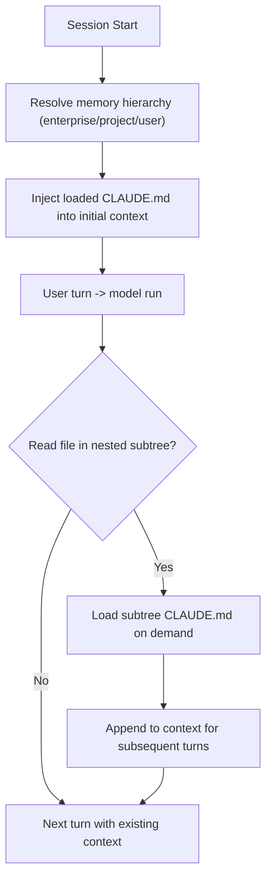
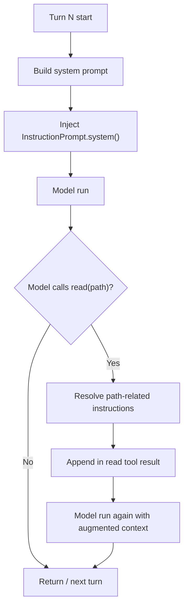
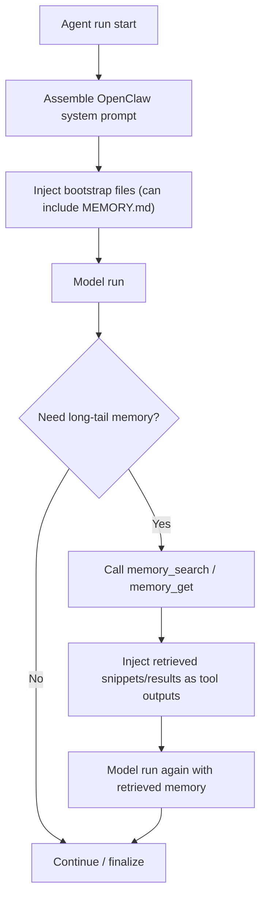

# Memory Architecture Compare (CC vs OpenCode vs OpenClaw)

## 1. 目标

本文聚焦三件事：

- memory 存储在哪里（storage plane）
- memory 如何进入模型上下文（injection plane）
- 在 agent loop 的哪个时机注入（loop timing）

对比对象：

- Claude Code (`cc`)
- OpenCode (`oc`)
- OpenClaw

---

## 2. 总览对比

| 项目 | Claude Code (cc) | OpenCode (oc) | OpenClaw |
|---|---|---|---|
| memory 主载体 | `CLAUDE.md` 分层文件 | `AGENTS.md` / `CLAUDE.md` + `instructions` | `MEMORY.md` + `memory/**/*.md` |
| 基础注入时机 | 启动时自动加载 | 每轮 prompt 组装时加载 system instructions | 每个 agent run 重建 system prompt 时加载 bootstrap |
| 运行时追加注入 | 读到子树文件时，按需纳入该子树 `CLAUDE.md` | `read(path)` 时追加邻近规则为 `<system-reminder>` | `memory_search` / `memory_get` 工具按需检索日常记忆 |
| 默认是否每轮都带 memory 正文 | 启动加载的层级记忆常驻会话 | system 指令每轮参与；路径规则按需追加 | `MEMORY.md` 可每轮注入；`memory/*.md` 默认不自动注入 |
| 典型优势 | 层级清晰，项目/用户边界明确 | 规则与路径上下文结合紧密 | 固定 bootstrap + 检索式 memory，窗口更可控 |

---

## 3. Claude Code (cc) 详细

### 3.1 存储层

官方 memory 层级（简化）：

- Enterprise policy memory
- Project memory (`./CLAUDE.md`)
- User memory (`~/.claude/CLAUDE.md`)
- 本地项目偏好（历史上有 `CLAUDE.local.md`，现推荐 import 方式）

### 3.2 注入层

- 启动会话时自动加载 memory 文件进入上下文。
- 目录向上递归查找当前工作目录链路中的 `CLAUDE.md`。
- 对于工作区子树中的 `CLAUDE.md`，不是启动时全量加载，而是在读到该子树文件时按需纳入。

### 3.3 loop 时机图

---

## 4. OpenCode (oc) 详细

实现依据：`/tmp/opencode/packages/opencode/src/session/instruction.ts`、`/tmp/opencode/packages/opencode/src/session/prompt.ts`、`/tmp/opencode/packages/opencode/src/tool/read.ts`。

### 4.1 存储层

- 项目规则：向上查找 `AGENTS.md`（优先）/ `CLAUDE.md`（兼容）
- 全局规则：`~/.config/opencode/AGENTS.md`
- Claude 兼容全局规则：`~/.claude/CLAUDE.md`（可通过环境变量禁用）
- 额外规则：`opencode.json` 中 `instructions`（本地路径、glob、URL）

### 4.2 注入层

有两条注入通道：

1. `system` 通道（每轮）
- 在 prompt 组装时，把 `InstructionPrompt.system()` 合并到 system prompt。

2. `tool-result` 通道（按需）
- 执行 `read(path)` 时，`InstructionPrompt.resolve(...)` 会解析该路径上层目录的规则文件。
- 若命中规则，会把规则文本包在 `<system-reminder>...</system-reminder>` 追加到 read 工具输出。

### 4.3 loop 时机图

---

## 5. OpenClaw 详细

### 5.1 存储层

- bootstrap memory 文件：`MEMORY.md`（或 `memory.md`）
- 日常记忆文件：`memory/**/*.md`
- memory 检索索引：每 agent SQLite（文档给出默认路径模板）

### 5.2 注入层

也是两条通道：

1. `system/bootstrap` 通道（每 run）
- OpenClaw 每次 run 都重建 system prompt。
- bootstrap 文件（含 `MEMORY.md`/`memory.md`）可注入 Project Context。

2. `memory tools` 通道（按需）
- `memory_search`：向量/语义检索 `MEMORY.md + memory/**/*.md` 的分块片段。
- `memory_get`：按路径与行范围读取具体 memory 文件。
- `memory/*.md` 默认不自动注入上下文，只有调用工具时才进入窗口。

### 5.3 loop 时机图

---

## 6. 关键结论（工程视角）

1. `cc` 更像层级规则常驻 + 子树懒加载。  
2. `oc` 是“每轮 system 基础规则 + read 路径增强注入”。  
3. `OpenClaw` 是“每轮 bootstrap 注入 + memory 工具检索式召回”。  
4. 从 token 控制看，检索式 memory（OpenClaw 风格）更容易控成本；从上手一致性看，层级文件常驻（cc/oc）更直观。  

---

## 7. 调研补充（含 AMemGym）

为后续 `v5 / v5.1 / v5.2` memory 规划，建议把研究对象按“架构风格 + 可评测性”分组：

- 分层/OS 风格：MemGPT (Letta), MemOS
- 抽取-检索服务风格：Mem0, Supermemory, SimpleMem
- 图谱/时序风格：Zep (Graphiti), EverMemOS
- 经验库/知识库风格：Agent-KB
- 基准评测风格：AMemGym

`AMemGym`（OpenReview）可作为我们教学 repo 的 memory 评测参照：

- 重点价值：把“长时任务下是否记得关键事实”转成可复现 benchmark
- 对工程的启发：除了功能可用，还要验证记忆命中率、遗忘率、污染率与任务成功率
- 对本项目的意义：可直接指导 v5 系列回归测试设计（不仅测功能，还测记忆质量）

---

## 8. 参考资料

- Claude Code Memory: https://docs.anthropic.com/en/docs/claude-code/memory
- Claude Code Settings: https://docs.anthropic.com/en/docs/claude-code/settings
- OpenCode Rules: https://opencode.ai/docs/rules/
- OpenClaw Agent Loop: https://docs.openclaw.ai/agent-loop
- OpenClaw System Prompt: https://docs.openclaw.ai/concepts/system-prompt
- OpenClaw Memory: https://docs.openclaw.ai/concepts/memory
- OpenClaw Context: https://docs.openclaw.ai/concepts/context
- AMemGym (OpenReview): https://openreview.net/forum?id=sfrVLzsmlf
- Agent Memory Survey: https://arxiv.org/abs/2512.13564
- Agent-Memory-Paper-List: https://github.com/Shichun-Liu/Agent-Memory-Paper-List
