# Agent Memory Research Overview (Teaching Draft)

> 快速入口：建议先读 `/Users/admin/work/agent_loop/docs/memory_focus_overview.md`，再回到本文看细节与扩展对比。

## 1. 先立整体认知框架（短期 vs 长期）

先用大白话说：  
LLM 本体只有“当前上下文窗口”的短期记忆。  
Agent memory 是窗口外的一套机制，目标是：

- 记住该记的内容
- 在需要时找回来
- 随时间更新和淘汰

再用工程语言说：  
LLM 本体只有短期记忆；Agent memory 是窗口外的长期机制。  
先把两层分清楚，再看各家实现，理解会更稳。

### 1.1 短期记忆（Short-term）

- 载体：当前会话上下文（messages、tool results、临时摘要）
- 时间尺度：当前 thread/session
- 目标：保证“这次任务”连续推进，不爆上下文
- 关键能力：裁剪、压缩、回填、重试

### 1.2 长期记忆（Long-term）

- 载体：文件、数据库、向量库、图谱、知识库
- 时间尺度：跨会话/跨任务
- 目标：让系统“下次还能记得”，并可检索复用
- 关键能力：抽取、存储、检索、更新、冲突消解、遗忘

### 1.3 两层的关系（实践里最常见）

- 短期层负责“当前任务能跑完”
- 长期层负责“关键信息不会丢”
- 工程上通常是混合闭环：
1. 对话中产生信息（短期）
2. 抽取沉淀到长期层（写入）
3. 下次任务再检索注入回短期层（召回）

### 1.4 各框架关注点（先给全局地图）

| 框架/系统 | 短期记忆侧重 | 长期记忆侧重 |
|---|---|---|
| Claude Code (cc) | 会话连续性 + 规则常驻上下文 | 分层 `CLAUDE.md`（规则/偏好） |
| OpenCode (oc) | 每轮 system + 路径提醒，控制会话行为 | 规则文件主导，弱结构化长记忆 |
| OpenClaw | compaction + flush + 检索注入混合 | `MEMORY.md` + `memory/*` + memory tools |
| Mem0 | 短期更多依赖外层编排 | 抽取-检索-更新流水线（服务化） |
| Zep/Graphiti | 会话中按需图检索回填 | 图谱时序长期记忆 |
| Letta/MemGPT | working memory + 上下文迁移 | core/archival 分层长期记忆 |
| SimpleMem/Supermemory | 轻量压缩与检索回填 | 以事实记忆服务为核心 |
| EverMemOS | 分层调度与生命周期管理 | Memory OS 级长期治理 |
| Agent-KB | 任务中经验复用 | 程序记忆/经验知识库 |
| AMemGym | 不提供生产短期层 | 评测长期记忆策略效果 |

一个完整 memory 系统通常有 6 个环节：

1. 写入（extract）
2. 存储（store）
3. 索引（index）
4. 检索（retrieve）
5. 注入（inject）
6. 治理（update/delete/expire）

---

## 2. Memory 的对象类型（先分对象，再谈架构）

建议按对象分 5 类：

- 规则记忆（Policy）：约束和规范
- 画像记忆（Profile）：用户偏好
- 事实记忆（Fact）：稳定事实
- 情节记忆（Episode）：发生过什么
- 程序记忆（Procedure）：怎么做更好

按静态/动态看：

- 静态：Policy、部分 Profile
- 半动态：Fact
- 动态：Episode、Task 进展、Procedure 提炼结果

### 2.1 同一任务下的 5 类记忆示例（便于理解）

场景：用户要求“做 3 页《本草纲目》PPT，中文输出，产物放到 `outputs/`”。

| 类型 | 示例内容 | 静态/动态 |
|---|---|---|
| Policy（规则） | “未经确认不要覆盖已有 PPT；交付前必须做一次页数与标题自检” | 静态 |
| Profile（画像） | “用户偏好中文；先给提纲再给正文” | 偏静态 |
| Fact（事实） | “PPT 脚本位于 `create_ppt.py`；输出目录是 `outputs/`” | 半动态 |
| Episode（情节） | “上一轮已完成封面与目录，第三页‘现代影响’尚未完成” | 动态 |
| Procedure（程序） | “历史主题 PPT 的稳定流程：列提纲 -> 查证来源 -> 生成页面 -> 执行脚本 -> 校验” | 动态（可沉淀为半静态） |

---

## 3. 主流实现流派（行业实践）

### 3.1 文件规则型

代表：Claude Code、OpenCode  
特征：`CLAUDE.md/AGENTS.md` 为主。  
优点：可解释、教学友好。  
缺点：规模上来后检索和冲突治理薄弱。

### 3.2 文件 + 检索混合型

代表：OpenClaw  
特征：`MEMORY.md` + `memory_search/get`。  
优点：可解释 + token 可控。  
缺点：依赖索引质量和检索策略。

### 3.3 抽取-检索流水线型

代表：Mem0、Supermemory、simplemem  
特征：从对话抽取事实，入库后检索注入。  
优点：工程落地快，适合助手形态。  
缺点：抽取错误会长期污染。

### 3.4 图谱/时序型

代表：Zep/Graphiti  
特征：记忆建图，显式关系和时间。  
优点：多跳推理和时间一致性强。  
缺点：实现复杂度高。

### 3.5 Memory OS 型

代表：MemGPT/Letta、MemOS、EverMemOS  
特征：分层管理（working/core/archival 等）。  
优点：体系完整，适合长期演进。  
缺点：一次性实现成本高。

### 3.6 经验库型

代表：Agent-KB  
特征：跨任务复用“做事经验”。  
优点：提升任务效率。  
缺点：不等于基础 memory 层。

### 3.7 评测型

代表：AMemGym  
特征：不是 memory 引擎，而是评测框架。  
价值：把“记忆能力”做成可重复评测。

---

## 4. 系统扫描（教学视角）

| 系统 | 定位 | 短期记忆怎么管理/维护 | 长期记忆怎么管理/维护 | 适用场景 |
|---|---|---|---|---|
| Claude Code (cc) | 文件规则记忆 | 会话内靠消息窗口 + 规则常驻；超长靠上下文压缩与轮次控制 | 通过分层 `CLAUDE.md`（企业/项目/用户）人工维护与版本化 | 交互式 coding assistant |
| OpenCode (oc) | 文件规则 + 路径增强 | 每轮重建 system 规则；按 `read(path)` 动态追加路径规则提醒 | 以 `AGENTS.md/CLAUDE.md` 文件更新为主，长期记忆主要靠规则文件演进 | 交互式 coding assistant |
| OpenClaw | 文件+检索混合 | 运行中做 compaction；压缩前可触发 flush；按需把检索结果回填当前回合 | 写入 `MEMORY.md`/`memory/*.md`；通过 `memory_search/get` + 索引刷新维护可检索长期记忆 | 本地/服务化 agent |
| MemGPT / Letta | 分层 memory 架构 | working memory 随会话滚动；窗口压力下把历史迁移为可检索形态 | core/archival 分层存储；通过 memory tools 做增删改查与持续整理 | 长期代理系统 |
| Mem0 | 抽取-检索流水线 | 短期上下文通常由宿主 agent loop 负责裁剪/压缩 | 回合后抽取记忆并 `add/update/delete`；检索 `search` top-k 注入；策略化冲突更新 | 助手/客服/企业应用 |
| Zep (Graphiti) | 图谱时序记忆 | 当前回合按需图检索，把高相关节点/边注入上下文 | 将事件持续写入时序图谱，维护实体关系与时间演化，支持增量更新 | 关系密集任务 |
| simplemem | 轻量检索记忆 | 用紧凑摘要块回填上下文，降低短期 token 压力 | 对历史内容做压缩提炼与去重合并，再入长期存储并按意图检索 | 成本敏感场景 |
| Supermemory | 记忆 API 层 | 每轮通过 API 检索片段并注入上下文 | 通过 `add/search/update` 管理记忆与关系（updates/extends 等），内置生命周期策略 | 多工具集成 |
| EverMemOS | Memory OS 工程化 | 任务执行时按层调度当前需要的记忆片段 | 采用编码-巩固-检索的分层管线，做长期治理（更新、压缩、淘汰） | 企业长期记忆 |
| Agent-KB | 经验知识库 | 当前任务先检索相似经验并作为执行参考 | 持续沉淀成功任务流程与策略，按任务类型维护经验库 | 多 agent 协作 |
| AMemGym | 评测框架 | 通过 on-policy 交互评测短期上下文管理是否有效 | 通过长期任务评测写入/召回/更新策略效果，不直接提供生产存储层 | memory 方法比较 |

---

## 4.1 不同框架在 5 类记忆上的强弱（教学视角）

| 框架/系统 | 更擅长 | 相对薄弱或较难处理 |
|---|---|---|
| Claude Code (cc) | Policy、Profile（规则类记忆清晰） | Fact/Episode 的结构化检索与冲突消解能力较弱 |
| OpenCode (oc) | Policy、局部 Episode（read 路径增强） | 跨会话 Fact 图谱与 Procedure 沉淀能力有限 |
| OpenClaw | Policy + Fact + Episode（文件+检索混合） | Procedure 自动提炼质量依赖检索与总结策略 |
| Mem0 | Fact、Profile、部分 Procedure（抽取-检索流程） | Policy 治理通常需要外层系统补齐；抽取错误会污染 |
| Zep / Graphiti | Fact、Episode、Procedure（关系/时序强） | Policy 规则表达不如文件规则直观；系统复杂度高 |
| Letta / MemGPT | 分层记忆较均衡（working/core/archival） | 工程门槛和运维复杂度较高 |
| MemOS / EverMemOS | 大规模分层治理与生命周期管理 | 对教学仓库偏重，落地成本高 |
| Supermemory / SimpleMem | Fact 检索效率与注入控制 | 复杂关系推理与高质量 Procedure 演进较弱 |
| Agent-KB | Procedure（经验复用） | 不是基础 memory 全栈，Policy/实时 Episode 依赖外部 |

一句话总结：

- `cc/oc`：规则记忆强，动态结构化记忆偏弱。  
- `Mem0/检索型`：事实记忆强，规则治理要外补。  
- `Zep/图谱型`：关系与时序强，工程复杂。  
- `OpenClaw`：可解释与可扩展的折中路线。  

---

## 4.2 产品级 Memory Loop 对照（精简）

| 系统 | 写入（Post-turn） | 检索（Pre/In-turn） | 更新/逐出 | 调用方式 |
|---|---|---|---|---|
| Claude Code (cc) | 以文件编辑为主（`CLAUDE.md`） | 会话启动/路径触发加载 | 主要人工维护 | 固定规则注入为主 |
| OpenCode (oc) | 规则文件更新（`AGENTS.md/CLAUDE.md`） | 每轮 system + `read` 时增强 | 以规则/文件治理为主 | 固定注入 + 工具触发补充 |
| OpenClaw | 写 `MEMORY.md` 与 `memory/*` | 每轮 bootstrap + memory tools 按需检索 | 索引刷新 + 生命周期治理 | 混合（固定+自主） |
| Mem0 | 抽取后 `add/update/delete` | `search` 检索 top-k 注入 | 冲突处理、批量治理 | 多为编排层固定调用 |
| Zep/Graphiti | ingest 事件到图谱 | graph/memory 检索注入 | 时序关系更新、衰减 | 混合（编排+工具） |
| Letta/MemGPT | core/archival 分层写入 | core 常驻 + archival 按需检索 | 分层迁移与替换 | 自主调用占比高 |
| SimpleMem | 压缩提炼后入库 | 意图感知检索 | 在线合并去重 | 常作独立组件固定调用 |
| Supermemory | `add` 记忆与关系更新 | hybrid search + rerank | 自动处理更新/遗忘/冲突 | API 固定调用，支持 MCP |
| EverMemOS | 编码-巩固写入 | 检索回填上下文 | 长周期治理（分层） | 常驻服务组件调用 |
| Agent-KB | 经验条目写入 | 按任务检索经验 | 经验演化与筛选 | 多用于外置经验层 |

一句话：

- 规则型（cc/oc）偏“固定注入”。  
- 服务型（Mem0/Supermemory/EverMemOS）偏“编排层固定调用”。  
- 代理型（OpenClaw/Letta）更常见“固定保底 + 模型按需调用”。

---

## 4.3 产品现状与能力画像（稍详细）

| 产品 | 现状（2026-02） | 基本原理/流程 | 典型场景 | 擅长 | 较弱/不擅长 | 参考 |
|---|---|---|---|---|---|---|
| Claude Code (cc) | 官方产品持续迭代，memory 文档稳定 | 分层 `CLAUDE.md` 规则记忆；启动加载 + 子树按需加载 | 本地代码助手、团队规范执行 | Policy/Profile 记忆清晰，可审计 | 结构化 Fact/Episode 自动治理弱 | [Memory](https://docs.anthropic.com/en/docs/claude-code/memory), [Settings](https://docs.anthropic.com/en/docs/claude-code/settings) |
| OpenCode (oc) | 开源项目活跃，规则文档持续更新 | 每轮 system 注入规则；`read(path)` 时追加路径相关提醒 | 交互式 coding agent | 规则注入直观，工程可解释 | 跨会话结构化长记忆能力有限 | [Rules](https://opencode.ai/docs/rules/) |
| OpenClaw | 开源框架，memory 插件化能力完整 | `MEMORY.md` + `memory/*.md`；每轮 bootstrap + `memory_search/get` 按需检索 | 本地或服务化 agent | 固定注入 + 检索召回平衡 | 检索质量依赖索引与配置 | [Memory](https://docs.openclaw.ai/concepts/memory), [CLI memory](https://docs.openclaw.ai/cli/memory) |
| Letta / MemGPT | 从论文到产品框架，MemGPT 思想清晰 | core memory 常驻 + archival/conversation 检索；memory tools 可编辑记忆 | 长期个性化助手、长对话系统 | 分层记忆体系完整 | 上手和工程复杂度较高 | [Architecture](https://docs.letta.com/guides/agents/architectures/memgpt), [Concept](https://docs.letta.com/concepts/letta/) |
| Mem0 | 产品+OSS 双线，文档完善 | 抽取-存储-检索-更新 CRUD；支持更新策略定制 | 客服、CRM、个性化应用 | Fact/Profile 抽取与检索工程化强 | 错误抽取会污染；Policy 需外层治理 | [Add](https://docs.mem0.ai/core-concepts/memory-operations/add), [Update](https://docs.mem0.ai/core-concepts/memory-operations/update), [Custom prompt](https://docs.mem0.ai/open-source/features/custom-update-memory-prompt) |
| Zep / Graphiti | 图谱记忆路线成熟，生态持续建设 | 事件抽取为时序知识图，语义+关键词+图检索融合 | 关系密集、时间敏感任务 | Fact/Episode/Procedure 关系推理强 | 实现与运维复杂度高 | [Paper](https://arxiv.org/abs/2501.13956), [Graphiti](https://github.com/getzep/graphiti) |
| SimpleMem | 新近开源，学术热度上升 | 语义压缩 -> 在线合成 -> 意图感知检索规划 | 成本敏感的长期记忆 | 高压缩与检索效率 | 生态成熟度仍在发展 | [Repo](https://github.com/aiming-lab/SimpleMem), [Paper](https://arxiv.org/abs/2601.02553) |
| Supermemory | API 产品化明显，接入友好 | 图记忆关系（updates/extends/derives）+ 混合检索与重排 | 快速接入 memory API 的产品 | 接入快，更新/遗忘机制工程化 | 深层时序推理依赖外层编排 | [Graph Memory](https://supermemory.ai/docs/concepts/graph-memory), [Search](https://supermemory.ai/docs/search) |
| EverMemOS | 开源 Memory OS 路线，企业叙事明显 | 编码（MemCell）-> 巩固（分层）-> 感知检索（多策略） | 长期企业记忆系统 | 分层治理完整 | 实施成本高，教学起步偏重 | [Repo](https://github.com/EverMind-AI/EverMemOS), [Paper](https://arxiv.org/abs/2601.02163) |
| Agent-KB | 研究方向明确，偏经验层 | 将历史成功经验沉淀为可复用知识，按任务检索 | 多 agent 协作、重复任务 | Procedure 经验复用强 | 非基础 memory 全栈 | [Paper](https://arxiv.org/abs/2507.06229) |
| AMemGym | 评测框架（非 memory 引擎） | on-policy 交互环境中评测写入/召回质量 | memory 方法对比、回归评测 | 诊断写入失败/召回失败有效 | 不直接提供生产 memory 服务 | [OpenReview](https://openreview.net/forum?id=sfrVLzsmlf) |

---

## 4.3.1 各框架“能做什么 / 标准能力接口 / 不擅长什么”

| 框架 | 主要能做什么 | 常见标准能力接口 | 不擅长 / 不适合 |
|---|---|---|---|
| Claude Code (cc) | 分层规则记忆与项目规范注入 | 文件规则加载、层级覆盖、会话上下文管理 | 自动抽取事实库、复杂冲突消解 |
| OpenCode (oc) | 每轮规则注入 + 路径相关提醒 | system 规则组装、`read(path)` 触发增强 | 跨会话结构化长期记忆治理 |
| OpenClaw | 文件记忆 + 检索回填 + compaction/flush | `memory_search`、`memory_get`、memory 文件写入、索引刷新 | 默认不强结构化抽取，质量依赖提示词 |
| Letta / MemGPT | 分层记忆（working/core/archival）与持续会话 | memory CRUD、分层检索、记忆工具调用 | 低成本轻量接入；工程复杂度较高 |
| Mem0 | 长期记忆抽取-更新-检索服务化 | `add`、`search`、`update`、`delete`、批量操作 | 严格规则治理（Policy）通常需外置系统 |
| Zep / Graphiti | 图谱时序记忆与关系检索 | 事件 ingest、graph query、时序/关系检索 | 简单项目中的低成本快速落地 |
| SimpleMem | 压缩提炼 + 轻量检索 | 记忆压缩、去重合并、意图检索 | 复杂关系推理和企业级治理 |
| Supermemory | API 化记忆接入与关系更新 | `add/search/update`、hybrid search、rerank | 高定制多层策略编排 |
| EverMemOS | 分层 memory OS 治理 | 编码/巩固/检索流水线、生命周期管理 | 轻量教学 demo、快速接入场景 |
| Agent-KB | 经验知识复用 | 经验采集、标签索引、任务检索 | 基础全栈 memory（事实+规则+画像） |
| AMemGym | memory 策略评测 | on-policy 环境、写入/召回指标评测接口 | 生产记忆存储与在线服务 |

说明：

- “标准能力接口”在不同框架命名不完全一致，但可抽象为：`write/add`、`search/retrieve`、`get/read`、`update`、`delete/expire`、`inject`。
- code agent 场景里，很多系统只完整实现了“规则注入 + 检索回填”，并未默认实现“自动抽取+逐出”的全链路。

---

## 4.4 产品原理与主流程（可直接阅读版）

### Claude Code (cc)
- 初始化：按层级加载 `CLAUDE.md`（企业/项目/用户）作为行为规则与偏好基线。
- 运行：每轮在已有上下文上继续推理，规则记忆长期稳定存在。
- 触发补充：当进入子目录并读取文件时，相关子树 `CLAUDE.md` 才按需纳入。
- 更新：通过 `/memory` 或 `#` 显式写入，最终落到 memory 文件。
- 设计取向：重“规则一致性与可审计”，弱“自动结构化事实治理”。

### OpenCode (oc)
- 初始化：解析项目/全局 `AGENTS.md`、`CLAUDE.md`、`instructions` 配置源。
- 每轮前：把上述规则组装进 system prompt（固定注入）。
- 执行中：模型调用 `read(path)` 时，会解析该路径关联规则并追加 `<system-reminder>`。
- 回合后：规则变更主要通过文件编辑生效，不依赖独立 memory DB。
- 设计取向：重“工程可解释 + 规则注入”，弱“跨会话动态事实管理”。

### OpenClaw
- 初始化：建立 workspace memory 约定（`MEMORY.md` + `memory/*.md`）。
- 每轮前：system prompt 固定注入 bootstrap（可含 `MEMORY.md`）。
- 执行中：模型可调用 `memory_search` / `memory_get` 按需检索具体片段。
- 维护：索引异步刷新，支持常驻场景下的持续更新与检索。
- 设计取向：固定注入与按需检索并存，适合教学到工程过渡。

### Letta / MemGPT
- 分层：区分 core memory（常驻）与 archival memory（外部可检索）。
- 每轮前：core memory 直接进入上下文，保证人格/长期目标连续性。
- 执行中：模型可通过 memory 工具对 core 做插入/替换，并检索 archival。
- 窗口管理：超出上下文后历史迁移到外部存储，再通过检索召回。
- 设计取向：体系完整，适合长期自治 agent，但工程门槛较高。

### Mem0
- 写入链路：`add` 时先抽取可记忆项，再做冲突判断，最后 upsert 入库。
- 检索链路：`search` 做召回与重排，返回 top-k 供外层注入上下文。
- 更新链路：`update/delete/batch` 做生命周期治理，可定制更新策略 prompt。
- 集成方式：通常作为独立 memory service，被 agent 编排层固定调用。
- 设计取向：工程化强，适合“助手形态 + 多会话事实记忆”。

### Zep / Graphiti
- 写入：将交互事件转为实体-关系-时间三元信息并持续建图。
- 检索：语义检索、关键词检索与图遍历融合，返回时间一致的上下文。
- 更新：图谱增量更新，支持关系演化与历史回溯。
- 使用方式：可作为 memory backend，也可通过工具方式让模型查询图。
- 设计取向：关系/时序推理强，适合复杂业务知识网络。

### SimpleMem
- 编码：将原始对话压缩为结构化“记忆单元”。
- 合并：在线语义合成，减少重复和冗余条目。
- 检索：先做意图识别，再规划检索路径与深度。
- 响应：返回紧凑上下文或直接产出答案支撑。
- 设计取向：强调低成本与高效率，适合资源敏感场景。

### Supermemory
- 写入：新增记忆时自动建立关系（如 updates/extends/derives）。
- 检索：hybrid search + rerank，按阈值返回高相关片段。
- 治理：内置更新/遗忘/冲突解析策略，支持 profile 与记忆分层。
- 集成：API/MCP 接入便捷，常作为“外部记忆服务”嵌入应用。
- 设计取向：产品接入快，适合 SaaS 化 memory 能力。

### EverMemOS
- 编码：把输入编码为可管理的记忆单元（MemCell）。
- 巩固：按层次沉淀到不同存储层（短期/长期/结构化层）。
- 检索：按任务目标执行多策略检索并回填模型上下文。
- 治理：强调长期运行下的调度、压缩与策略管理。
- 设计取向：Memory OS 路线，适合企业级长期系统。

### Agent-KB
- 采集：把成功任务中的关键流程与经验抽取为可复用条目。
- 组织：按任务类型/能力标签建索引。
- 检索：新任务到来时优先召回类似经验，指导当前规划与执行。
- 迭代：新成功案例持续反哺知识库。
- 设计取向：偏“程序记忆/经验复用”，不是基础记忆全栈。

### AMemGym（评测框架）
- 环境：提供 on-policy 交互任务，模拟长期记忆场景。
- 执行：agent 与环境多轮交互，动态写入并检索记忆。
- 反馈：按成功率、记忆命中、写入失败等指标打分。
- 用途：比较不同 memory 策略，而不是直接提供生产 memory 服务。
- 设计取向：用于“测与练”，帮助定位写入与召回缺陷。

### 4.5 压缩与 flush 的边界

- `memory flush`：压缩前的记忆落盘回合，目标是把可能跨轮复用的信息写入 memory 文件。
- `compaction`：对会话历史做摘要压缩，目标是降低当前上下文 token 占用。

两者关系：先 `flush`（尽量保留长期信息），再 `compaction`（缩短历史上下文）。

### 4.6 三套实现的主流程（OpenClaw / oc / deer-flow）

#### 4.6.1 OpenClaw（工程化最重）

实现备注（基于源码与本地核对）：

- OpenClaw 的 `memoryFlush.prompt/systemPrompt` 默认是“提醒写 durable memories”，并未强制结构化提炼。
- 因此 flush 文件内容在默认配置下可能接近原始对话抄录，而不一定是高质量摘要。
- 真正的历史压缩摘要写在 transcript 的 `compaction entry`，不在 `memory/YYYY-MM-DD.md`。

#### 4.6.2 OpenCode (oc)（轻量压缩路径）

#### 4.6.3 deer-flow（middleware 风格）

#### 4.6.4 对比结论

- 实现复杂度：`OpenClaw > deer-flow >= oc`
- OpenClaw 强在“防爆、回退与可恢复工程性”
- oc / deer-flow 强在“路径短、实现轻、易上手”

---

## 5. Benchmark 全景（主要测什么）

先分两类看：

- A 类：直接测 memory 系统能力
- B 类：主要测长上下文能力（可参考，但不等同 memory）

### 5.1 A 类：Memory 核心基准

| Benchmark | 主要考察 |
|---|---|
| LongMemEval | 多会话事实召回、时间推理、更新与拒答 |
| LoCoMo | 长对话中的 QA、总结、跨轮一致性 |
| AMemGym | on-policy 交互式记忆能力（更接近真实 agent） |
| ConvoMem | 用户事实/偏好/变化事实等多维记忆 |
| MemoryAgentBench | 检索、测试时学习、长程理解、冲突解决 |
| GoodAI LTM Benchmark | 持续长程记忆维护与整合 |

### 5.2 B 类：长上下文能力基准

| Benchmark | 说明 |
|---|---|
| RULER | 长上下文检索/追踪/聚合，偏 context 能力 |
| Needle/InfBench/HELMET 类 | 长文本定位和理解，非完整 memory pipeline |

---

## 6. Benchmark 的“当前 SOTA”怎么读

记忆赛道的 “SOTA” 经常不可直接横比，原因：

- 不同 benchmark
- 不同 judge model
- 不同 prompt 与检索预算
- 不同延迟口径
- on-policy / off-policy 设置不同

因此建议把结果分三层：

1. 官方 leaderboard（若有）
2. 论文/预印本结果
3. 厂商自报结果

### 6.1 当前可见结果（截至 2026-02-17，教学摘录）

| Benchmark | 可见高分口径 | 备注 |
|---|---|---|
| LongMemEval | Mastra OM 报 `94.87%`（自报） | 另有论文系统报 `91.4%` |
| LoCoMo | Backboard 报 `90.1%`（自报） | 另有论文系统报 `89.61%` |
| AMemGym | 主要是框架论文中的对比表 | 更适合作“统一评测协议” |
| ConvoMem | 新基准，公开统一榜单仍少 | 强调不同 context budget 下性能变化 |
| MemoryAgentBench | 目前偏诊断，不是刷榜成熟阶段 | 关注四项能力短板 |

注：表内“自报”不等于无效，只是需要统一协议复现后再做结论。

---

## 7. 对本项目（教学 repo）的启发

1. 先定对象类型，再选架构。  
2. v5 先做可解释 memory（规则 + 画像 + 任务摘要）。  
3. v5.1 再引入抽取-检索（Mem0 思路）。  
4. v5.2 才做常驻治理（索引刷新、冲突处理、生命周期管理）。  
5. 评测至少要跑：LongMemEval + AMemGym（或同类 on-policy 套件）。

---

## 8. 参考资料

- Survey: https://arxiv.org/abs/2512.13564
- Agent-Memory-Paper-List: https://github.com/Shichun-Liu/Agent-Memory-Paper-List
- AMemGym: https://openreview.net/forum?id=sfrVLzsmlf
- Claude Code Memory: https://docs.anthropic.com/en/docs/claude-code/memory
- OpenCode Rules: https://opencode.ai/docs/rules/
- OpenClaw Memory: https://docs.openclaw.ai/concepts/memory
- Letta MemGPT: https://docs.letta.com/guides/agents/architectures/memgpt
- Mem0 Paper: https://arxiv.org/abs/2504.19413
- Mem0 Docs: https://docs.mem0.ai/
- Zep Paper: https://arxiv.org/abs/2501.13956
- Graphiti: https://github.com/getzep/graphiti
- MemOS: https://arxiv.org/abs/2505.22101
- MemOS (Memory 3.0): https://arxiv.org/abs/2507.03724
- EverMemOS: https://github.com/EverMind-AI/EverMemOS
- SimpleMem: https://github.com/aiming-lab/SimpleMem
- Supermemory Docs: https://docs.supermemory.ai/
- Agent-KB: https://arxiv.org/abs/2507.06229
- LongMemEval: https://arxiv.org/abs/2410.10813
- LoCoMo: https://arxiv.org/abs/2402.17753
- ConvoMem: https://arxiv.org/abs/2511.10523
- MemoryAgentBench: https://arxiv.org/abs/2507.05257
- GoodAI LTM Benchmark: https://github.com/GoodAI/goodai-ltm-benchmark
