# Skill 原理（精简版）

本文只讲三件事：
- v5 当前实现是怎么注入 skill 的
- 为什么这是“渐进式披露”
- 和主流实现（deepagents / opencode / pi-mono）差异

## 1. 当前实现（v5）

代码入口：
- loop：`loops/agent_loop_v5_skill_tools.py`
- skill 扫描：`core/skill_loader.py`

运行机制：
1. 每轮请求前，system prompt 注入 `<available_skills>` 元信息（name/description/location）。
2. 模型如果判断需要某个 skill，会调用 `read_skill(name)`。
3. `read_skill` 返回 `<skill ...> + SKILL.md 正文`，再进入后续轮次。

这就是“先元信息、后正文”的渐进式披露。

## 2. 当前注入报文（示意）

```json
{
  "messages": [
    {
      "role": "system",
      "content": "...\n<available_skills>\n  <skill><name>pptx</name><location>/Users/admin/.claude/skills/pptx/SKILL.md</location></skill>\n</available_skills>"
    },
    { "role": "user", "content": "做 3 页 ppt 讲述本草纲目" }
  ],
  "tools": [
    {
      "type": "function",
      "function": {
        "name": "read_skill",
        "parameters": {
          "type": "object",
          "properties": { "name": { "type": "string" } },
          "required": ["name"]
        }
      }
    }
  ]
}
```

命中后会出现：
- assistant tool_call：`read_skill({"name":"pptx"})`
- tool result：`<skill name="pptx" ...> ...SKILL.md... </skill>`

## 3. 与主流方案对比（结论表）

| 框架 | 初始把 skill 列表放哪 | 正文怎么加载 | 特点 |
|---|---|---|---|
| deepagents | system（Available Skills） | 调 `skill(name)` 工具 | system + tool 双通道 |
| opencode | `skill` 工具 description（`<available_skills>`） | 调 `skill(name)` 工具 | 工具通道最强 |
| pi-mono | system（`<available_skills>`） | 调 `read(SKILL.md)` | 文件读取式按需加载 |
| 本项目 v5 | system（`<available_skills>`） | 调 `read_skill(name)` | 采用 pi-mono 思想，增加专用工具便于教学 |

## 4. 为什么选这个方案

原因很直接：
- 教学可解释性强：学生能清楚看到“目录信息”和“正文加载”是两步。
- Token 更可控：不把所有 skill 全文提前塞进 system。
- 工程上更稳：比纯 prompt 注入更容易观察和调试（可见 tool call / tool result）。

## 5. 调试建议

- 先看是否出现 `<available_skills>`
- 再看是否触发 `read_skill(name=...)`
- 若长任务未收敛，优先看：
  - 依赖是否可用（如 `pptxgenjs`）
  - tool 回合是否耗尽（`max_tool_rounds`）

## 6. 流程图


